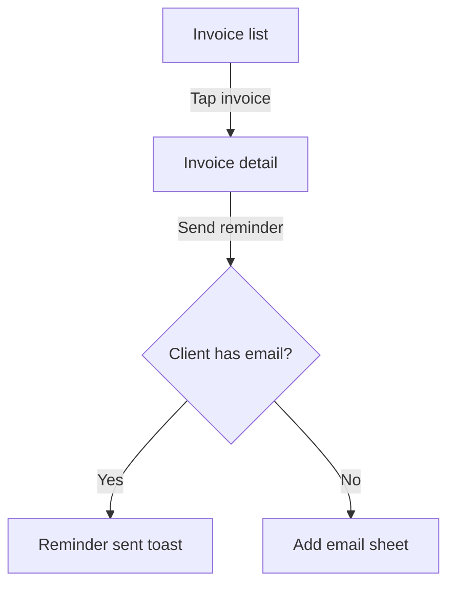

# spec-writer — complete instruction set

Six connected product documents: MRD, BRD, PRD, Design Spec, TRD, QA Test Plan. Start with the router, then follow the module for the stage you're on.


---

# MODULE: spec-writer

> Router and shared conventions for the product documentation chain — MRD, BRD, PRD, Design Spec, TRD, QA Test Plan. Use when the user wants product/project documentation but hasn't named a specific document type, asks which document they need, wants several documents produced in sequence, or asks to check that an existing set of docs is consistent and traceable.

# Spec Writer

The entry point for a six-document chain. Each document answers one question, at one altitude, for one audience — and each is generated from the one above it so a product can be traced from market opportunity all the way to test coverage.

| # | Document | Module | Answers | Primary audience |
|---|---|---|---|---|
| 1 | MRD — Market Requirements | `mrd-writer` | What market problem should we solve, and is it worth solving? | Founders, exec sponsors |
| 2 | BRD — Business Requirements | `brd-writer` | What business outcome does this support, and what will it take? | Sponsors, approvers, finance |
| 3 | PRD — Product Requirements | `prd-writer` | What should the product actually do? | Product, design, engineering |
| 4 | Design Spec | `design-spec-writer` | What does the user see and do, screen by screen? | Design, frontend, QA |
| 5 | TRD — Technical Requirements | `trd-writer` | How will engineering build it? | Engineering, architecture |
| 6 | QA Test Plan | `qa-test-plan-writer` | How do we prove it works? | QA, automation |

## Routing

Pick the stage by what the user *has*, not by what they said:

First settle the scope (see below), because it decides how many stages even apply. Then:

- Only an idea, a sentence, a hunch → **`mrd-writer`**. If they explicitly don't want market validation and just want to build, go straight to `prd-writer` and say you skipped the MRD/BRD.
- An MRD, or a project that's already been decided on but needs sponsor/budget sign-off → **`brd-writer`**.
- A validated problem and a decision to build → **`prd-writer`**.
- A PRD with user-facing surface area (any UI at all) → **`design-spec-writer`**.
- A PRD, with or without a design spec → **`trd-writer`**.
- A PRD, design spec, or TRD, and a need for coverage → **`qa-test-plan-writer`**.
- "Give me the full set" / "document this idea end to end" → run the chain in order, stopping after each document to confirm before spending effort on the next. Do not silently generate six documents from one sentence; each one inherits the previous one's assumptions, and a wrong turn at the MRD stage poisons all five below it.
- A feature being added to something that already exists → **`prd-writer`**, at feature scope, inheriting the product's existing documents. Don't start at the MRD unless the feature opens a new market segment.
- "Review / check my docs" → read what exists, then report against **Traceability** and **Layer discipline** below.

Skip stages the user genuinely doesn't need — a small internal tool rarely needs an MRD and a BRD. State plainly which stages you skipped and why, so the gap is a decision rather than an oversight.

## Scope: whole product, or one feature

The chain works at three scopes. Pick one before routing — running product-scale documents for a single feature is the fastest way to make the whole set something nobody reads.

| | **Product** | **Feature** | **Change** |
|---|---|---|---|
| Typical input | A new product or product line | A substantial addition to something that exists | A fix, tweak, or small enhancement |
| MRD | Full | Only if it opens a new segment or changes positioning — otherwise a paragraph of evidence inside the PRD | Skip |
| BRD | Full | Only if it needs its own funding, headcount, or sponsor sign-off | Skip |
| PRD | Full | **Start here.** Scoped to the feature, inheriting product context | One page: problem, requirements, acceptance criteria |
| Design Spec | Full | New and changed screens only, plus the states they add to existing ones | Only if the UI changes |
| TRD | Full | The delta: what's added, what's modified, what the blast radius is | Only if the design is non-obvious |
| QA Test Plan | Full | New cases, plus regression scope for what the change can reach | Cases for the change, plus its regression scope |

### Working at feature scope

**Inherit, don't re-derive.** Personas, platforms, design tokens, architecture, NFRs, and compliance posture all come from the product's existing documents. Cite them and state only what this feature *changes*. A feature PRD that restates the product's personas has buried its one new idea in recycled context.

**Namespace the IDs** with a short feature slug so the feature's documents merge into the product's set without collision: `PR-EXPORT-01`, `SCR-EXPORT-02`, `FR-EXPORT-01`, `TC-EXPORT-001`. Keep the same slug across all of the feature's documents.

**Say what it touches.** The most valuable section in any feature document is the one naming existing behavior this could break — the screens it modifies, the shared components it changes, the API contracts it alters, the data it migrates. That section is what the test plan's regression scope is built from, and the thing most often missing when a feature ships and something unrelated breaks.

**Keep the required sections, shrink them.** *Assumptions and Open Questions* and *Next Steps* stay at every scope. A section that genuinely doesn't apply is marked `Not applicable — <reason>`, never deleted — see **Absent sections** below; at feature scope most sections are a sentence rather than a page.

If the user hands you a feature but wants the full chain anyway, produce it — just say which stages you'd normally collapse and why, so the choice is theirs rather than yours.

## Shared conventions

Every stage in this chain follows these. They are what make six documents one system instead of six unrelated files.

### Layer discipline

Each document stays at its own altitude. The most common failure in requirement docs is content leaking down a layer — an MRD that lists features, a PRD that picks a database, a design spec that describes API pagination.

| Layer | Belongs here | Belongs elsewhere |
|---|---|---|
| MRD | Market, users, pain, competitors | Any feature list → PRD |
| BRD | Outcomes, scope, cost, sign-off | System behavior → PRD/TRD |
| PRD | Product behavior, requirements, metrics | Architecture, stack → TRD |
| Design Spec | Screens, flows, states, content | Data models, endpoints → TRD |
| TRD | Architecture, APIs, data, NFRs | Business justification → BRD |
| QA Test Plan | Cases, coverage, risk | New business rules → question log |

When you catch a sentence in the wrong layer, move it or cut it — and if it's genuinely new information, note it for the document where it belongs.

### Traceability IDs

Every numbered item gets a stable ID, and every ID cites its parent. This is what lets a reviewer ask "which market need does this test case ultimately serve?" and get an answer.

```
MRD   NEED-01   market need / high-level product requirement
      GOAL-01   business goal                 → no upstream; the root of the outcome chain
BRD   BR-01     business requirement          → traces to NEED-xx (or GOAL-xx)
      R-01      risk register entry           → document-local; nothing downstream traces to it
PRD   PR-01     product requirement           → traces to BR-xx (or NEED-xx)
      MET-01    success metric or guardrail   → traces to BR-xx (or GOAL-xx)
      DEC-01    decision-log entry            → document-local; supersedes an earlier DEC-xx
DS    FLOW-01   user flow                     → traces to PR-xx
      SCR-01    screen / surface              → traces to PR-xx
      CMP-01    component                     → traces to SCR-xx
TRD   FR-01     functional requirement        → traces to PR-xx (and SCR-xx where a design spec exists)
      NFR-01    non-functional requirement    → traces to MET-xx, a PR-xx, or a BRD constraint
      API-01    endpoint / interface          → traces to FR-xx
QA    REQ-01    derived requirement           → no upstream; flags a gap in the source document
      TC-001    test case                     → traces to any ID above
```

Never invent a parent ID. If an item has no upstream parent, mark it `[no upstream — new in this document]` and add it to Assumptions and Open Questions. Orphans are usually either a genuine gap in the parent doc or scope creep, and both are worth surfacing.

### Document header

Every generated document opens with this block, so its lineage is readable without opening anything else:

```markdown
**Owner:** <name or role>
**Date:** <today's date>
**Version:** 0.0.1
**Status:** Draft | In review | Approved | Superseded
**Scope:** Product | Feature | Change
**Platforms:** <declared in the MRD; carried unchanged, or "platform-neutral">
**Upstream:** <exact upstream filename — `invoice-tracker-prd-ios-v0.2.0.md` — or "Informal brief">
**Downstream:** <what this document feeds next>
```

Two stages extend this block, and only these two: the PRD adds `**Stage:**`, naming which of its six stages the document is at, and the design spec adds `**Design file:**`, linking the visual source or saying "none yet". Any other field is one a reader has to guess at.

### Reading upstream

A document is built from a file, not from the conversation, so resolving that file is part of the work. Every stage below the MRD follows the same four rules:

1. **The producing skill's folder is the source** — `docs/prd-writer/` for a PRD, `docs/trd-writer/` for a TRD, or the project's own documentation directory where one replaces `docs/`.
2. **Highest version wins.** Compare `v<major>.<minor>.<patch>` numerically (`v0.0.10` is newer than `v0.0.9`). Read an older version only when the user asks for it by name, and say so in the header block.
3. **Platform matches platform.** A per-platform document is built from its own platform's upstream file; where the upstream is a single file with no platform token, every platform reads that one.
4. **The exact filename goes in `**Upstream:**`** — version and platform included. A stage reading several documents lists them all, comma-separated, one filename each: the TRD cites its PRD and design spec, the test plan cites all three. A missing one reads as "this document was written without it". Combined with rule 2, that is what makes the staleness check below mechanical rather than a judgement call: compare the cited filename against the newest file in the upstream folder.

On a re-run, the document's own previous version records which upstream version it was built from. Diff the newest upstream against that one and change only what the difference requires, rather than redrafting from scratch.

### Absent sections

No section is ever deleted from a template — an omission is invisible, and the shape of the standard is what makes a gap legible. A section with nothing in it carries one of three markers, and which one you pick is itself information:

| Marker | Means |
|---|---|
| `Not applicable — <reason>` | This section will never apply to this product. |
| `Insufficient evidence — <what would resolve it>` | It applies and is due now, but nothing supports it yet. This is a research task someone can pick up. |
| `Not yet — stage <n>` | PRD only: the section belongs to a later stage of that document's six. |

The second is the one that earns its keep: "insufficient evidence" is an honest finding, and a fabricated number in its place is not.

### Mandatory sections

Three sections appear in every document in this chain, regardless of type:

- **Revision History** — one appended row per version, directly under the header block (see below).
- **Assumptions and Open Questions** — every gap you filled with a guess, and every question that genuinely needs a human. Fabricating a number, a stakeholder, a business rule, or a limit is worse than admitting it's unknown.
- **Next Steps** — the next document or decision, who owns it, and what has to be true before it starts.

### Revision history

Filenames carry versions; the Revision History says what those versions *mean*. Every document opens with this table, directly below the header block, and every new version appends one row — rows are never rewritten or removed.

```markdown
## Revision History

| Version | Date | Author | Upstream version | Summary | IDs added | IDs changed | IDs removed |
|---|---|---|---|---|---|---|---|
| 0.1.0 | 2026-09-22 | A. Rahman | `invoice-tracker-brd-v0.2.0.md` | Offline receipt capture added | PR-08, MET-02 | PR-01 | PR-04 |
| 0.0.1 | 2026-09-14 | A. Rahman | `invoice-tracker-brd-v0.1.0.md` | Initial draft | — | — | — |
```

The three ID columns are what make this more than a diary. A downstream stage re-running against a revised document reads these rows instead of re-reading the whole document, and the staleness check can then say *what* went stale rather than just that something did. `—` means none; an empty cell means the change wasn't tracked, which is a gap to fix rather than a state to leave.

### The changelog

`docs/CHANGELOG.md` is **mandatory**. Writing a document version is not finished until its entry is in the changelog — the Revision History says what changed inside one document, and the changelog is the one place that answers "what moved across the whole set, and when."

It lives at the root of `docs/` (or of whatever documentation directory replaces it), beside the per-skill subfolders, and covers every document in the set. Create it on the first write if it is missing; never rewrite an existing entry.

```markdown
# Changelog — invoice-tracker

Specification documents for this product, newest first. One entry per document
version: `+` added, `~` changed, `-` removed.

## 2026-09-22

- **PRD** `prd-writer/invoice-tracker-prd-ios-v0.1.0.md` — offline receipt capture added.
  +PR-08, +MET-02, ~PR-01, -PR-04. Upstream `brd-writer/invoice-tracker-brd-v0.2.0.md`.
- **TRD** `trd-writer/invoice-tracker-trd-ios-v0.0.2.md` — queue and retry design for offline capture.
  +FR-12, +API-04. Upstream `prd-writer/invoice-tracker-prd-ios-v0.1.0.md`.

## 2026-09-14

- **PRD** `prd-writer/invoice-tracker-prd-ios-v0.0.1.md` — initial draft. Upstream `brd-writer/invoice-tracker-brd-v0.1.0.md`.
```

Rules, so the file stays mechanical rather than becoming prose:

1. **One bullet per document version**, under an ISO date heading. Append to today's heading, or create it at the top if it isn't there.
2. **The path is repo-relative from `docs/`**, so a reader can open it directly.
3. **The ID deltas match that version's Revision History row** exactly — same IDs, shortened to `+` / `~` / `-`. If the two disagree, the Revision History is right and the changelog entry is wrong.
4. **Per-platform writes get one bullet each**, because they are separate files with separate versions. A shared change touching four platform files appears four times, which is exactly the visibility that structure needs.
5. **Never edit a past entry.** A correction is a new version with a new entry.

Where a team cuts releases, add a `## Release 1.2 — 2026-10-01` heading above the dates it covers. That grouping is optional; the per-version entries are not.

### Quality bar and review mode

Every stage carries two things beyond its template, and both are part of the contract:

**A quality bar** — a pre-delivery checklist in the skill, worked before the file is written, not after. The checks are deterministic: does `**Upstream:**` name the newest file on disk, does every ID cite a real parent, does every number have a source, is every absent section marked. A document delivered without its bar worked is a draft presented as a deliverable. The bar is per stage because what can be checked mechanically differs by layer — an MRD checks that every figure has a method and a date; a design spec checks thirteen states per screen; a test plan checks that no case ships a vague oracle.

**A review mode** — what to do when asked to review an existing document rather than write one. Report against the template's section numbers so every gap is addressable, work that stage's quality bar as the checklist, and name the smallest concrete edit that closes each gap. Reviewing is not rewriting: report what's missing, don't quietly fill it.

### Working style

- **Don't interrogate.** Draft from thin input, label the assumptions, and move. Ask only when the answer materially changes the document — and batch the questions into one pass.
- **Evidence over assertion.** Cite the source, the user's own words, or the upstream document. "Limited evidence" is a legitimate finding; an invented market-size figure is not.
- **Concrete over vague.** "Reduce invoice processing time by 30% by Q2" beats "improve invoicing." Push every requirement toward something a reader could verify was met.
- **Concise, not exhaustive.** These documents exist to be read and acted on. A tight paragraph beats a wall of bullets.
- **Deliver a file, not a chat dump.** See the output contract below — every stage in this chain produces a Markdown file and names it.
- **Living documents.** Say so on handoff. When re-running against a revised upstream doc, diff it, update only affected IDs, bump the version, and preserve decision history rather than silently rewriting it.

## Standards each document follows

Each stage is structured on the recognised standard for its document type, so the output is reviewable by someone who has never seen this chain. When a template section looks unnecessary for a small project, keep it and mark it with one of the **Absent sections** markers — the shape of the standard is what makes an omission visible.

| Stage | Standard | What it governs |
|---|---|---|
| MRD | Pragmatic Institute framework | Market problem, buyer vs user personas, TAM/SAM/SOM, positioning, distribution |
| BRD | BABOK v3 (IIBA); ISO/IEC/IEEE 29148:2018 BRS | Requirement classification, RACI, risk register, sign-off |
| PRD | INVEST stories, Given/When/Then, MoSCoW | Product-layer requirements and acceptance criteria |
| Design Spec | WCAG 2.2 AA, W3C ARIA Authoring Practices | States, components, accessibility, localization |
| TRD | ISO/IEC/IEEE 29148:2018; ISO/IEC 25010:2023 | Requirement form and quality; NFR classification |
| QA Test Plan | ISO/IEC/IEEE 29119-3:2021 (superseded IEEE 829) | Plan structure, entry/exit, suspension/resumption |

Two conventions run across all six. Requirements use the **29148** sentence form — *[condition] [subject] [action] [object] [constraint]* — with *shall* binding, *should* recommended, *may* optional. And every requirement is judged against the nine **29148** quality characteristics: necessary, appropriate, unambiguous, complete, singular, feasible, verifiable, correct, conforming.

## Platforms

The chain is platform-independent by default and platform-specific on demand. The platform is declared **once**, in MRD Section 5, and carried in every downstream header block. Nothing below the MRD re-decides it; each stage just adds what its own layer owes that platform.

Where no platform is declared, write platform-neutrally and say so — "the user opens the overdue view," not "taps" or "clicks." An unstated platform silently becomes whatever the first engineer assumes, which is the failure this section exists to prevent.

| | Web | Mobile (iOS / Android) | Desktop (macOS / Windows / Linux) |
|---|---|---|---|
| **MRD** | Browser reach, no-install trial | Store discovery, store economics (commission, review) | Enterprise procurement, offline-capable field use |
| **BRD** | Hosting and bandwidth cost | Developer accounts, store fees, per-platform build cost | Code-signing certificates, notarization, distribution |
| **PRD** | Responsive breakpoints, browser support bar, SEO, PWA install | Permissions, offline and sync, push, deep links, store policy | Windowing, menu bar, file-system access, auto-update, OS login item |
| **Design Spec** | Breakpoints, hover and focus, keyboard, print | Touch targets, safe areas, system back, orientation, keyboard avoidance | Window states and resizing, native menus, keyboard shortcuts, multi-window, drag-and-drop, tray |
| **TRD** | Browser support matrix, bundle budget, CDN, CSP | Minimum OS versions, API deprecation, binary size, store review, OTA updates | Packaging and installers, signing and notarization, auto-update channel, per-OS filesystem and permissions |
| **QA** | Browser × OS × viewport matrix | Device × OS-version matrix, store submission, upgrade and permission flows | Per-OS install, upgrade, uninstall, offline, signed-build verification |

### Multi-platform

Several platforms is the normal case, not the exception, and it needs three things beyond a list.

**A primary platform.** Exactly one — it ships first and breaks ties when platforms want different things. Without it, every cross-platform disagreement is re-argued from scratch.

**A stated parity intent.** Full parity, deliberately reduced scope on some platforms, or capability that exists on only one. Unstated parity is the most expensive assumption in a multi-platform build, and it surfaces late — usually as "wait, that's not on Android?" during launch review.

**A platform column on every requirement.** This is the mechanism that keeps a multi-platform product traceable as it diverges. Every numbered item carries the platforms it applies to — `All` for the common case, a named subset when it doesn't:

```
NEED-04   Mobile only      capture a receipt at the moment of purchase
BR-09     Mobile           field staff capture without connectivity
PR-08     iOS, Android     capture a photo and attach it to an invoice
SCR-09    iOS, Android     receipt capture screen
CMP-07    iOS, Android     ReceiptCapture component
FR-12     iOS, Android     queue locally, upload on reconnect
TC-041    iOS, Android     capture offline, reconnect, verify upload order
```

Then one rule of construction *inside* a document: **specify shared behavior once and list only the deltas.** Where the same requirement behaves differently per platform, keep one row and put the difference in its acceptance criteria — never split it into near-duplicate rows, which drift apart by the second revision. Most functional requirements on a multi-platform product are a single shared-backend behavior serving several clients; mark those as shared, and the genuinely client-specific ones stand out as the ones needing per-platform attention.

### Per-platform documents

Where more than one platform is declared, four stages produce one complete document per platform rather than one document covering all of them: **PRD, Design Spec, TRD, and QA Test Plan**. The MRD and BRD stay single — market and business cases are not platform-bound.

`docs/<skill-name>/<slug>-<type>-<platform>-v<version>.md`, with `<platform>` drawn from a fixed vocabulary: `web`, `ios`, `android`, `macos`, `windows`, `linux`, `api`. One platform, or platform-neutral, means one file with no platform token.

Each file is standalone and complete — shared behavior written out in full, not cross-referenced — and four rules keep the set from drifting:

1. **IDs are global.** A requirement on several platforms carries the same ID in every file; a platform-only requirement takes the next ID from the same sequence and appears only in its own file. Never renumber per platform.
2. **Shared content is written identically.** A diff between two platform files should show real divergence and nothing else.
3. **A shared change touches every file** in the same run, each bumped to its next version. A new iOS file beside a stale Android one is the failure this structure invites.
4. **Parity is stated in every file** — full parity, reduced scope here, or unique to this platform — with the sibling files named.

The cost is deliberate and worth stating: shared requirements now exist in several copies, and keeping them identical is manual work at every revision. The consistency review below is what catches it when they diverge.

## Output contract

Every document in this chain is delivered as a Markdown file. A document that exists only in a chat transcript can't be reviewed, approved, diffed, or handed to the next stage — so the file is the deliverable, and the message is just the pointer to it.

Deliver by the highest tier the environment supports: **(1)** write to the filesystem where one is available, **(2)** produce a downloadable file or document surface where there's no repo, or **(3)** in a chat-only environment, emit the whole document in one fenced code block tagged `markdown` and name the file to save it as. The filename is the same in all three cases.

| Stage | Module | File |
|---|---|---|
| 1 | `mrd-writer` | `docs/mrd-writer/<slug>-mrd-v<version>.md` |
| 2 | `brd-writer` | `docs/brd-writer/<slug>-brd-v<version>.md` |
| 3 | `prd-writer` | `docs/prd-writer/<slug>-prd-v<version>.md`, or one per platform |
| 4 | `design-spec-writer` | `docs/design-spec-writer/<slug>-design-spec-v<version>.md`, or one per platform |
| 5 | `trd-writer` | `docs/trd-writer/<slug>-trd-v<version>.md`, or one per platform |
| 6 | `qa-test-plan-writer` | `docs/qa-test-plan-writer/<slug>-test-plan-v<version>.md`, or one per platform |

Each skill owns one subfolder of `docs/`, named after the skill, so a product's six documents are grouped by the stage that produced them. Use one consistent `<slug>` across all six files for a given product — that's what makes the set readable as a set.

Where a filesystem exists, create `docs/` only when it is missing; if it already exists, write into it untouched. Create the skill's subfolder inside it the same way. Where the project already has a documentation directory (`documentation/`, `doc/`, a docs site's content folder), use that instead of creating `docs/`, with the same per-skill subfolder inside it.

After writing, report the path and a 3–5 line summary: what the document covers, the biggest assumption made, and the open questions that need a human. Don't reprint the body.

If the user asks for another format — PDF, Google Doc, Word, spreadsheet — write the Markdown first and export from it, so one file stays the source of truth.

### Versioning

Every document filename ends in its version: `<slug>-<type>-v<major>.<minor>.<patch>.md`. Versions accumulate — a new version is a new file, and an existing one is never overwritten or deleted, so the folder is the document's history.

Before writing anything, list the skill's subfolder and find the highest version already there for that `<slug>`. Compare the three numbers numerically, so `v0.0.10` is newer than `v0.0.9`. Read that file before drafting; the new document is a revision of it.

| Bump | When |
|---|---|
| first write | `v0.0.1` |
| patch `v0.0.x` | edits, corrections, gaps filled |
| minor `v0.x.0` | new sections or requirements, or a re-run against a revised upstream document |
| major `vx.0.0` | **Status** reaches Approved, or a rewrite that invalidates downstream documents |

The header block's **Version** always matches the filename's version, and a document cites the exact upstream version it was built from — `Upstream: invoice-tracker-prd-v0.2.0.md`. That pairing is what makes the staleness check below mechanical rather than a judgement call.

When running several stages in sequence, confirm each document is delivered before starting the next — the next stage reads the document, not the conversation. In a chat-only environment, that means the previous document's Markdown block must be complete and on screen before the next stage begins.

## Consistency review

When asked to check an existing set, report on:

1. **Coverage** — every parent ID has at least one child; list the ones that don't.
2. **Orphans** — every child cites a real parent; list the ones that don't.
3. **Unmarked orphans** — a child whose Upstream cell is blank or `—` instead of `[no upstream — new in this document]`. More common than a fabricated parent, and it reads as traced when it isn't.
4. **Layer violations** — content sitting in the wrong document.
5. **Staleness** — a child whose upstream document has a newer version file on disk than the version the child cites in its header.
6. **Contradictions** — the same rule, limit, or metric stated differently in two documents. Log both; don't pick a winner.
7. **Platform drift** — where a stage produced per-platform files, a shared ID whose text, acceptance criteria, or priority differs between them, and any platform file left at an older version than its siblings.
8. **Untracked change** — a document whose newest version added no Revision History row, or whose row leaves the ID columns blank. Both break the diff every downstream stage depends on.
9. **Missing changelog entry** — a document version on disk with no bullet in `docs/CHANGELOG.md`, or an entry whose ID deltas disagree with that version's Revision History row.


---

# MODULE: mrd-writer

> Turns a simple app or product idea into a full Market Requirements Document (MRD) with market research and competitive analysis. Use whenever the user mentions an MRD, wants to validate a product/app idea before building it, or asks about market opportunity, target audience, or competitors for an idea.

# MRD Writer

Stage 1 of the spec-writer chain. Feeds `brd-writer` and `prd-writer`.

## What this does

Takes a simple app or product idea — sometimes just a sentence — and turns it into a complete Market Requirements Document: a strategic document that explains *why* the idea is worth building, before anyone talks about features or a build plan. An MRD answers "what market opportunity is this chasing," "who actually has this problem," "how are they solving it today," and "how will we know this worked." It deliberately stays away from feature lists and technical specs — that's the PRD's job.

Because the input is usually a rough idea rather than a company with a research team, do the market research yourself, reason about the audience and competitive landscape, and produce a document that reads like it came out of a real product-discovery process — not a template with blanks.

## Workflow

### Step 1 — Understand the idea

Read what the user gave you. A "simple app idea" might be one line ("an app that helps freelancers track invoices") or a short paragraph. Identify, even tentatively: what the app does, who it's plausibly for, and what problem it solves.

### Step 2 — Ask the user for scope and platforms

**This is the one question to ask before drafting.** The MRD is where scope and platform are decided for the entire chain — every document below inherits both from here — so guessing them wrong is expensive in a way no other early guess is. Ask once, in a single batched question, and offer a recommendation so the user can accept rather than compose an answer.

Ask for:

1. **Scope** — is this a whole product, or a feature of something that already exists? Recommend based on what they described.
2. **Platforms** — web, iOS, Android, macOS, Windows, Linux, API or CLI, or undecided. **Multiple platforms are the normal answer, not the exception**, so ask for a set rather than a single choice, and for three things about that set: which platform is **primary** (the one that ships first and wins a tie), which are **phased** and roughly when, and what the **parity intent** is — full parity, deliberately reduced scope on some platforms, or capability that exists on only one. Say which way the research points and why, so they're confirming a recommendation rather than starting from a blank.

Then act on the answer:

- **Whole product** → continue with the full MRD below.
- **A feature** → an MRD is usually the wrong document, because the market, personas, and positioning are already settled and re-deriving them buries the one new question. Say so and point at `prd-writer` at feature scope. Write a feature-scale MRD only when the feature genuinely opens a new market — a new segment, a new buyer, a change in positioning, or a new pricing tier — and then keep it to what actually changes: that segment, its evidence, the competitive response, and sizing for it alone.
- **Platforms named** → record the full set verbatim in the header block and Section 5 — with the primary marked, the phasing kept, and the parity intent stated — and let them shape the research: store economics and review policy for mobile, browser reach and no-install trial for web, procurement and offline field use for desktop. With several platforms, research each one's economics separately; a segment that's cheap to reach on web can be expensive to reach through a store.
- **Undecided, or the user defers** → that's a legitimate answer, not a failure. Record "undecided," write the document platform-neutrally, and use Section 5 to lay out the evidence for each candidate so the decision has something to stand on later. Never silently pick one.

Don't hold up the whole document waiting. If the user doesn't answer, state your assumption plainly in the header and in Section 14, and draft — an assumption on the record is recoverable; a silent one isn't.

### Step 3 — Otherwise, ask only if genuinely stuck

Beyond scope and platforms, don't interrogate — most gaps can be filled with reasonable assumptions plus research, and over-questioning a "simple idea" defeats the point. Ask only when a core fact is unknowable from research *and* materially changes the document: the idea is ambiguous between two very different products, or the user has a specific target market in mind you shouldn't guess at. State assumptions in Section 14 rather than blocking on them.

Where you do have more to ask, fold it into the Step 2 question rather than sending a second round.

### Step 4 — Research the market

Ground the document in reality rather than invented numbers. Where you have web search or browsing, use it. Where you don't, say so plainly in Section 7 and mark every research-dependent claim as unverified — a document that admits it couldn't check is far more useful than one that guesses confidently. Look for:

- **Market sizing** — TAM, SAM, and SOM, each with the method stated (top-down from an analyst figure, or bottom-up from users × price). An unsourced number with no method is worse than a range with one
- Growth signals for the category or an adjacent one
- Evidence the target users actually experience the problem — forum complaints, review-site pain points, survey or industry-report stats
- How people solve this today — direct competitors, adjacent tools, manual workarounds (spreadsheets, generic tools bent into shape)
- Competitor strengths, weaknesses, pricing patterns, and gaps to differentiate on
- Trends that make this a good or bad time to build — platform changes, regulatory shifts, technology enablers

Cite what you find inline (source name, and a link where you have one) rather than presenting it as settled fact. Where research is thin or conflicting, say so — an honest "limited evidence" beats a confident fabrication, and it belongs in the risks section anyway.

**Date every figure.** Market data goes stale faster than anything else in this chain. Prefer sources published within the last 24 months, give each figure its publication date inline, and state the as-of date at the head of Section 3. Where the only available figure is older than that, use it and say how old it is — a dated number a reader can discount beats an undated one they have to trust.

### Step 5 — Draft the MRD

Use the document template. Keep it grounded in the customer problem, not the feature set — if you catch yourself listing UI details or a tech stack, that content belongs in a PRD or TRD. Every non-obvious claim should be traceable to research or to something the user told you.

Give each item in Section 10 a `NEED-xx` ID, and each goal in Section 9 a `GOAL-xx` ID. These are the anchors the rest of the chain traces back to, so write them as durable customer needs and outcomes, not as features that might change.

At feature scope, namespace both with the feature's slug — `NEED-EXPORT-01`, `GOAL-EXPORT-01` — so the feature's IDs merge into the product's set without colliding. Use the same slug across every document for that feature.

### Step 6 — Quality bar before delivering

- Exactly one platform is marked primary, and the parity intent is stated in a sentence — not implied by the table.
- Every phased platform names what phase 2 depends on: a date, a metric, or a decision.
- Every `NEED-xx` has a Platforms value; `All` is a choice, not a default to fall back on.
- Every `NEED-xx` is a durable customer need, not a feature — no UI, no screens, no stack.
- Every TAM/SAM/SOM cell has a figure, a method, and a source; a figure with no derivation is replaced by a range plus what would narrow it.
- Every research-dependent claim is either cited or explicitly marked unverified, with the reason stated in Section 7.
- Every figure carries its publication date, and Section 3 states its as-of date.
- Buyer and user are separated in Section 4 wherever they are different people.
- Every `GOAL-xx` traces to something the user actually said; the rest are open questions in Section 14.
- Every metric in Section 15 cites a `GOAL-xx` and has a baseline, a target, and a date.
- Sections 12 and 13 are present and answered — a hypothesis or an explicit "none apply", never an omission.
- Revision History carries a row for this version, with the `NEED-xx` and `GOAL-xx` IDs added, changed, and removed since the previous one.
- Every section that doesn't apply is marked `Not applicable — <reason>` or `Insufficient evidence — <what would resolve it>`, never deleted.
- Nothing in the document describes how the product works — that's the PRD's job, and the most common way this document fails.

### Step 7 — Save and deliver

**This document set always ends in a Markdown file. Never deliver it as ordinary chat prose.**

Deliver by the highest tier the environment supports:

1. **Filesystem available** (coding agent, IDE, terminal, code interpreter) — write `docs/mrd-writer/<slug>-mrd-v<version>.md`. Create `docs/` only if it is missing — never recreate or replace an existing one — then create the `mrd-writer/` subfolder inside it if that is missing too, so each skill's output stays in its own folder. Where the project already has a documentation directory, use that in place of `docs/`, with the same `mrd-writer/` subfolder inside it. Report the path.
2. **Files or a document surface, but no repo** (downloadable file, canvas, doc, notebook) — create it there named `<slug>-mrd-v<version>.md` and hand over the download or link.
3. **Chat only** — put the entire document in one fenced code block tagged `markdown`, with nothing else inside the fence, and name the file the user should save it as: `<slug>-mrd-v<version>.md`. Everything you want to say goes before the fence, never interleaved.

Use one consistent `<slug>` across every document in the chain for a given product — the same slug the first document in the chain started with — so the six files read as one set. At feature scope the slug is the feature, not the product. The folder is per skill, the slug is per product: `docs/mrd-writer/<slug>-mrd-v<version>.md`.

**Versioning.** Every write creates a new file; an existing version file is never overwritten or deleted.

Before drafting, list `docs/mrd-writer/` and find the highest `v<major>.<minor>.<patch>` among files matching `<slug>-mrd-v*.md`. Compare the three numbers numerically, so `v0.0.10` is newer than `v0.0.9`. That file is the previous version — read it first, so the new document is a revision rather than a restart.

- No previous file — start at `v0.0.1`.
- **Patch** (`v0.0.x`) — edits, corrections, gaps filled, wording.
- **Minor** (`v0.x.0`) — new sections or requirements, or a re-run against a revised upstream document.
- **Major** (`vx.0.0`) — **Status** reaches Approved, or a rewrite that invalidates the documents downstream of this one.

The `**Version:**` line in the header block always carries the same number as the filename, and every version appends a row to the document's **Revision History** — what changed, and which IDs were added, changed, and removed. Report the new path and that summary, not just that a file was written.

**The changelog is mandatory.** After writing the file, append one bullet to `docs/CHANGELOG.md` — at the root of `docs/`, beside the per-skill subfolders — under today's ISO date heading, creating the file or the heading if either is missing:

```markdown
- **MRD** `mrd-writer/<filename>` — <one-line summary>. +<IDs added>, ~<IDs changed>, -<IDs removed>. Upstream `<upstream path>` (every upstream, comma-separated, or "informal brief" where there is none).
```

The IDs must match the Revision History row for this version. Never edit a past entry — a correction is a new version with a new entry. Per-platform writes get one bullet each — and where this stage writes a single file whatever the platform set, that file gets one bullet. The document is not delivered until this entry exists.

Whatever the tier:

- The document is Markdown: header block first, then every section. A section with nothing to say carries `Not applicable — <reason>` or `Insufficient evidence — <what would resolve it>`, never an omission.
- Report the **filename plus a 3–5 line summary** — what it covers, the biggest assumption, the open questions that need a human. Don't restate the body in prose.
- Other formats — PDF, Google Doc, Word, spreadsheet — are exports *from* the Markdown, never replacements for it.
- Re-running after the idea changes or new research lands produces the next version file — see the versioning rule above — rather than editing the previous one in place.


### Step 8 — Hand off

Note that an MRD is a living document, meant to be revisited as the idea evolves or new research lands. Point at the natural next step: `brd-writer` if the project needs sponsor or budget sign-off, `prd-writer` if the user is building it themselves and just needs to decide what to build.

## MRD Template

Use this section structure. Adapt depth to how much there is to say, but never delete a section. One that genuinely doesn't apply is marked `Not applicable — <reason>`; one that applies but has nothing behind it yet is marked `Insufficient evidence — <what would resolve it>`. Both are more useful than a missing section, and the second is a research task the reader can pick up.

```markdown
# Market Requirements Document: [App Name]

**Owner:** [user's name, or "Solo / early-stage"]
**Date:** [today's date]
**Version:** 0.0.1
**Status:** Draft | In review | Approved | Superseded
**Scope:** Product | Feature | Change
**Platforms:** [the full set, primary marked — e.g. "web (primary), iOS, Android — desktop phase 2" — or "undecided"]
**Upstream:** Informal brief
**Downstream:** BRD / PRD

## Revision History

| Version | Date | Author | Upstream version | Summary | IDs added | IDs changed | IDs removed |
|---|---|---|---|---|---|---|---|
| 0.0.1 | [today's date] | [author] | Informal brief | Initial draft | NEED-01–NEED-08 (every ID in this draft) | — | — |

One appended row per version, never rewritten. The ID columns are what let a downstream document diff this one without re-reading it in full; `—` means none, and an empty cell means the change wasn't tracked, which is a gap worth fixing.

## 1. Executive Summary
One paragraph: the customer problem, the target market, the business objective, and the expected outcome. Written so a busy stakeholder gets the whole picture without reading further. Write this last.

## 2. Market Opportunity
The market gap, relevant trends, and why this matters *now*. Narrative and timing only — growth direction, not magnitude. Every number lives in Section 3, cited once; referencing it here is fine, restating it is how the two sections drift apart. Focus on the market, not the app's feature set.

## 3. Market Sizing
*Figures as of [date].* Every number in this document lives here; the rest of the document references these rows rather than restating them.

TAM, SAM, and SOM, each with the figure, the method used to reach it, and the source with its publication date. Where the evidence won't support a number, give a range and say what would narrow it — never a single confident figure with no derivation.

| Measure | Figure | Method | Source | Published |
|---|---|---|---|---|
| TAM | | top-down / bottom-up | | |
| SAM | | | | |
| SOM (12 mo) | | | | |

A source older than 24 months stays usable — say how old it is in the Published column and note the staleness in Section 14, rather than dropping the only evidence there is.

## 4. Target Audience
Segment the market, then profile the personas within it. **Separate the buyer from the user** — they are frequently different people with different pain, and conflating them is the most common way an MRD misleads. For each persona: role, context, the problem in their words, how often it bites, what they use today, and what would make them switch.

Be specific — "freelance designers billing 3–10 clients a month," not "freelancers."

## 5. Target Platforms
Which platforms this must reach, and why — a market question before it is a technical one, because it follows from where the buyers and users already are. State the platform here once; every document downstream inherits it rather than guessing.

| Platform | Primary | Priority | Why — evidence from research | Phase |
|---|:-:|---|---|---|
| Web (responsive) | ✓ | Must | Buyers evaluate at a desk; no install friction for trial | 1 |
| iOS | | Should | 60% of the segment's usage is mobile (source) | 2 |
| Android | | Should | Same usage pattern; larger share outside North America | 2 |
| Desktop (macOS/Windows) | | Could | Only if offline editing proves to be a real blocker | — |

Exactly one platform is primary — it ships first and breaks ties when platforms want different things. Then state the **parity intent** in a sentence, because it is the most expensive thing to leave unsaid in a multi-platform build:

> *Parity intent:* full feature parity between web and mobile, except bulk import and admin settings, which stay web-only. Desktop, if built, matches web.

Where platforms are phased, say what "phase 2" depends on — a date, a metric, or a decision — rather than leaving it as an intention.

Cover the ones that apply: **web** (responsive, PWA, browser support), **mobile** (iOS, Android, tablet), **desktop** (macOS, Windows, Linux — native or Electron-class), and any **non-UI surface** (API, CLI, embedded, watch, TV). Note where one platform is a hard requirement of the market rather than a preference — regulated industries that forbid mobile, field work with no connectivity, an enterprise buyer that mandates a desktop client.

If the platform genuinely isn't decided yet, say so explicitly and write the rest of the document platform-neutrally. An undecided platform is a legitimate early state; an unstated one silently becomes whatever the first engineer assumes.

## 6. Customer Problems and Pain Points
The concrete pain: who feels it, how often, and what it costs them in time, money, errors, or stress. Support with what research turned up — reviews, forum threads, survey data.

## 7. Market Research and Insights
A short synthesis of the research: relevant stats, report findings, observed patterns, each attributed to its source.

## 8. Competitive Analysis
Direct competitors, adjacent tools, and the manual workarounds people use today. Note strengths, weaknesses, pricing patterns, and where the gap is. A table works well here.

## 9. Business Goals
What building this should accomplish — validate a niche, generate revenue, build a portfolio piece, solve the founder's own problem at scale. Keep this honest to what the user actually said; mark it an open question if they didn't say. One row per goal, because Section 15 and every downstream metric cite these IDs rather than quoting the prose.

| ID | Goal | Why it matters | Evidence or source |
|---|---|---|---|
| GOAL-01 | Validate that freelancers will pay for invoice chasing before building the full product | Decides whether stage 2 happens at all | User's stated intent |

A goal the user didn't state is an open question in Section 14, not an invented `GOAL-xx`.

## 10. High-Level Product Requirements
What the product must let users accomplish, at a strategic level — not a feature list, not UI, not a stack. One row per need.

| ID | Need | Platforms | Which pain point it addresses | Priority |
|---|---|---|---|---|
| NEED-01 | Users need a way to see every overdue invoice across all clients at a glance | All | Section 6, missed follow-ups | Must |
| NEED-04 | Users need to capture a receipt photo at the moment of purchase | Mobile only | Section 6, lost receipts | Should |

The **Platforms** column is what keeps a multi-platform product traceable as it diverges. "All" is the common case; naming a subset is a decision that should survive into the PRD rather than being rediscovered during design.

## 11. Positioning
A single positioning statement, in the standard form, plus the one claim a competitor could not make:

> For **[target persona]** who **[statement of need]**, **[product]** is a **[category]** that **[key benefit]**. Unlike **[primary alternative]**, it **[primary differentiator]**.

## 12. Pricing, Packaging, and Distribution
What the market already pays and how it prefers to buy: competitor price points and models (subscription, usage, perpetual, free tier), the willingness-to-pay signal research turned up, plausible packaging tiers, and the channels this reaches buyers through. Mark as hypothesis where research is thin — but don't omit it. A product strategy with no pricing or channel view isn't a strategy.

## 13. Regulatory and Compliance Landscape
Rules that constrain entry or operation — data protection (GDPR, CCPA), sector rules (HIPAA, PCI DSS, SOC 2), accessibility mandates, platform or app-store policy, licensing. Where none apply, say so explicitly; an empty section reads as unexamined.

## 14. Assumptions and Open Questions
Every assumption made to fill a gap, plus market risks, competitive risks, and questions research couldn't resolve. Thin evidence and guesses get flagged here honestly.

## 15. Success Metrics
How the team would know this worked after launch — adoption, retention, activation, revenue. Every metric cites the `GOAL-xx` it measures; a metric with no goal is either a vanity number or a goal nobody wrote down, and both need resolving before the PRD inherits it.

| Metric | Measures | Baseline | Target | By when |
|---|---|---|---|---|
| Paid conversion from trial | GOAL-01 | None — pre-launch | 5% | 90 days after launch |

Give each a baseline, a target, and a date — a metric with no baseline can't be shown to have moved. Where the baseline doesn't exist yet, write "none — pre-launch" rather than leaving it blank. These are the anchors the PRD's `MET-xx` traces back to through `GOAL-xx`.

## Next Steps
The next document, its owner, and what must be true before it starts.
```

## Reviewing an existing MRD

When asked to review rather than write, report against the template's section numbers so every gap is addressable, and work the Step 6 quality bar as the checklist. Three passes. **Evidence:** every figure with no method, no source, or no date, and every claim asserted where the document elsewhere admits it couldn't verify — market data is the first thing to go stale, so check Section 3's as-of date before anything else. **Layer:** every sentence describing how the product works rather than what problem it solves for whom; that content belongs in the PRD and its presence here is the most common way this document fails. **Decisions:** whether exactly one platform is primary, whether the parity intent is stated, and whether every `NEED-xx` and `GOAL-xx` still reflects what the user actually said. Then name the smallest concrete edit that closes each gap, and say plainly if the research now argues against the opportunity — that is a finding, not a failure of the review.

## Standards this follows

Structured on the **Pragmatic Institute** market-requirements framework: market problem first, buyer and user personas separated, sizing quantified, positioning stated explicitly, and a distribution and pricing view rather than features. Where a section can't be evidenced, it stays in the document marked as a gap — the shape of the standard is what makes the gap visible.

## Writing principles

- **Problem before solution.** The point of an MRD is validating that a problem is real and worth solving before anyone designs anything. Resist the pull toward describing the app.
- **Evidence over assertion.** A cited source or the user's own context is worth far more than a confident guess. Where you have no evidence, say so instead of inventing a number.
- **Concise, not exhaustive.** A tight, well-reasoned paragraph beats a wall of bullets.
- **Don't let it become a PRD.** If a sentence describes *how* the product works rather than *what problem it solves for whom*, cut it or move it out.
- **It's a real decision input.** The user may use this to decide whether to build at all — give your honest read, including when the research suggests the opportunity is weak or heavily contested.

## How an MRD differs from the rest of the chain

- **MRD** (this document) — what market problem should we solve?
- **BRD** — what business outcome should this support, and what will it take?
- **PRD** — what should the product actually do?
- **Design Spec** — what does the user see and do?
- **TRD** — how will engineering build it?
- **QA Test Plan** — how do we prove it works?

If the user asks for a PRD, feature spec, or roadmap next, that's a natural follow-on but a different document — don't fold it into the MRD.


---

# MODULE: brd-writer

> Turns an MRD or a plain description of a project into a full Business Requirements Document (BRD) covering executive summary, objectives, scope, business requirements, stakeholders, constraints, and cost-benefit analysis. Use whenever the user mentions a BRD, business requirements, wants to formalize a project idea or MRD for stakeholder sign-off, or asks what a project needs before development starts.

# BRD Writer

Stage 2 of the spec-writer chain. Reads an MRD (or a brief); feeds `prd-writer`.

## What this does

Takes an existing Market Requirements Document or a plain-language project description — a paragraph, a bullet list, a rough brief — and turns it into a complete Business Requirements Document: the formal report that aligns stakeholders on what a project is, why it's happening, and what it will take to deliver. A BRD answers "what business outcome should this support," "what's in and out of scope," "who signs off," and "is this worth the cost." It stays at the business level; it does not specify how the system works.

An MRD input is the common case: the MRD explains the market opportunity, and the BRD is the natural next step once someone decides to greenlight a project around it — translating market validation into a business-outcome-and-scope document a sponsor can approve. This works just as well from a few sentences with no prior document.

## Reading the upstream documents

This stage reads the MRD. In a repository the documents are on disk, versioned, and possibly split per platform, so resolve them deliberately rather than taking the first file that matches.

| Upstream | Where it lives |
|---|---|
| MRD | `docs/mrd-writer/<slug>-mrd-v*.md` |

1. **Look in the producing skill's folder**, or in the project's documentation directory where one replaces `docs/`.
2. **Take the highest version.** Compare `v<major>.<minor>.<patch>` numerically, so `v0.0.10` is newer than `v0.0.9`. Never read an older version just because it came up in conversation. If the user names an older one deliberately, use it and say so in the header block.
3. **Match the platform.** Where you are producing a per-platform document, read the upstream file for *that* platform — the iOS document is built from the iOS upstream, not from the set. Where the upstream was written as a single file with no platform token, every platform reads that one.
4. **Cite the exact filename** in `**Upstream:**`, version and platform included — `invoice-tracker-prd-ios-v0.2.0.md`. Where this stage reads several documents, list them all, comma-separated; a missing one reads as "written without it". That line is what makes the staleness check mechanical: a reviewer compares it against the newest upstream file on disk.
5. **On a re-run, diff rather than redraft.** Your own previous version file names the upstream version it was built from. Compare that against the upstream you just resolved, and change only what the difference requires.

Outside a repository — a pasted document, an attachment, or a document drafted earlier in this conversation — apply the same rules to what you were given, and where the version genuinely isn't knowable write `**Upstream:** <name> (version unknown)` rather than inventing one.

## Workflow

### Step 1 — Understand the input

**From an MRD:** read it in full and map what carries over — the problem and opportunity become context for objectives; the target audience becomes stakeholder and user context; the `GOAL-xx` business goals become project objectives, keeping their IDs as the objectives' upstream; the `NEED-xx` items become the starting point for business requirements, reframed as business needs rather than product features. Note what an MRD does *not* give you and a BRD needs: a concrete scope boundary, a stakeholder roster, project constraints, and a cost-benefit analysis. Derive or assume those, and label them.

**From plain text:** identify what the project is, who wants it, and what problem it solves. Most of the rest will be inferred or flagged as an assumption — expected and fine.

### Step 2 — Carry scope and platforms forward

If the MRD declares them, copy both into this document's header block verbatim and don't ask again. If there's no MRD and this is the first document in the chain, ask the user once — scope (product, feature, or change) and target platforms (web, iOS, Android, macOS, Windows, Linux, API, or undecided) — in a single batched question with a recommendation attached, exactly as the `mrd-writer` scope-and-platforms question describes. Record the answer; never pick silently.

Scope then decides whether this document is needed at all. A BRD exists to get a project approved and funded. At **feature scope** that's usually already true — the product is funded, the team exists, and the sponsor signed off long ago. Write one for a feature only when it needs its own money, headcount, vendor, or formal sign-off, or when it carries a compliance or contractual obligation.

When you do, inherit the product's stakeholders, constraints, and glossary rather than rebuilding them, and keep the document to what this feature changes: its objectives, its scope boundary, its incremental cost, and its risks. Otherwise say so plainly and point the user at `prd-writer`.

### Step 3 — Ask only if genuinely stuck

Don't interrogate the user. A BRD can be drafted from thin input as long as gaps are handled honestly. Ask only when something is unknowable *and* materially changes the document — the input is ambiguous between two very different projects, or the cost-benefit analysis needs figures there's no reasonable way to estimate. Batch the questions into one pass.

### Step 4 — Draft the BRD

Use the document template. Keep every section at the business level — if you catch yourself describing UI, a tech stack, or step-by-step system behavior, cut it or reframe it as a business need ("users need to see overdue invoices at a glance" rather than "add a red badge to the dashboard").

Classify each requirement the way BABOK v3 does, because the four types get approved by different people and satisfied by different work: **business** (the enterprise-level outcome), **stakeholder** (what a specific group needs), **solution** (functional and non-functional capability), and **transition** (temporary — migration, training, cutover — retired once the change lands). Transition requirements are the ones teams forget until go-live week.

Give each business requirement a `BR-xx` ID, a type, a priority, a one-line rationale, and the `NEED-xx` it traces to — or the `GOAL-xx` where the requirement serves a business outcome rather than a customer need. A requirement with no upstream need is either a gap in the MRD or scope creep — mark it `[no upstream — new in this document]` and raise it in Section 11.

At feature scope, namespace the IDs with the feature's slug — `BR-EXPORT-01` — so this feature's requirements merge into the product's set without colliding. Use the same slug the feature's other documents use.

### Step 5 — Write the executive summary last

Draft every other section first, then come back to the summary. Writing it last is what makes it accurate rather than a guess at what the document will say.

### Step 6 — Quality bar before delivering

- `**Upstream:**` names the exact MRD filename with its version, and it is the newest one on disk.
- Revision History carries a row for this version, with the `BR-xx` IDs added, changed, and removed since the previous one.
- Every objective in Section 2 cites the `GOAL-xx` it inherits, or carries `[no upstream — new in this document]` and an entry in Section 11.
- Every `BR-xx` has a type, a priority, a Platforms value, a rationale, and a real upstream ID — never an invented one.
- All four BABOK types are considered, and transition requirements are present or explicitly declared none — they are the ones teams discover in go-live week.
- Section 3 carries an explicit exclusions list; an empty one means scope isn't bounded yet.
- Exactly one **A** per decision area in the RACI, and no row left without a named role or a `[TBD]` placeholder.
- Constraints, assumptions, and dependencies are separated in Section 7, and every dependency has an owner and a needed-by date.
- Every risk is scored and owned; an unowned risk is noted, not managed.
- Cost-benefit is either quantified or plainly declared not yet quantifiable — never a confident invented ROI.
- Every success criterion cites a `GOAL-xx` or `BR-xx` and has a baseline, a target, a method, and a review date.
- The glossary defines every acronym and role name used above; a BRD crosses departments.
- The approval block is present, even where every approver is TBD.
- Every section that doesn't apply is marked `Not applicable — <reason>` or `Insufficient evidence — <what would resolve it>`, never deleted.
- Nothing in the document specifies UI, stack, or system behavior — that's the PRD and TRD, and the most common way this document fails.

### Step 7 — Save and deliver

**This document set always ends in a Markdown file. Never deliver it as ordinary chat prose.**

Deliver by the highest tier the environment supports:

1. **Filesystem available** (coding agent, IDE, terminal, code interpreter) — write `docs/brd-writer/<slug>-brd-v<version>.md`. Create `docs/` only if it is missing — never recreate or replace an existing one — then create the `brd-writer/` subfolder inside it if that is missing too, so each skill's output stays in its own folder. Where the project already has a documentation directory, use that in place of `docs/`, with the same `brd-writer/` subfolder inside it. Report the path.
2. **Files or a document surface, but no repo** (downloadable file, canvas, doc, notebook) — create it there named `<slug>-brd-v<version>.md` and hand over the download or link.
3. **Chat only** — put the entire document in one fenced code block tagged `markdown`, with nothing else inside the fence, and name the file the user should save it as: `<slug>-brd-v<version>.md`. Everything you want to say goes before the fence, never interleaved.

Use one consistent `<slug>` across every document in the chain for a given product — the same slug the first document in the chain started with — so the six files read as one set. At feature scope the slug is the feature, not the product. The folder is per skill, the slug is per product: `docs/brd-writer/<slug>-brd-v<version>.md`.

**Versioning.** Every write creates a new file; an existing version file is never overwritten or deleted.

Before drafting, list `docs/brd-writer/` and find the highest `v<major>.<minor>.<patch>` among files matching `<slug>-brd-v*.md`. Compare the three numbers numerically, so `v0.0.10` is newer than `v0.0.9`. That file is the previous version — read it first, so the new document is a revision rather than a restart.

- No previous file — start at `v0.0.1`.
- **Patch** (`v0.0.x`) — edits, corrections, gaps filled, wording.
- **Minor** (`v0.x.0`) — new sections or requirements, or a re-run against a revised upstream document.
- **Major** (`vx.0.0`) — **Status** reaches Approved, or a rewrite that invalidates the documents downstream of this one.

The `**Version:**` line in the header block always carries the same number as the filename, and every version appends a row to the document's **Revision History** — what changed, and which IDs were added, changed, and removed. Report the new path and that summary, not just that a file was written.

**The changelog is mandatory.** After writing the file, append one bullet to `docs/CHANGELOG.md` — at the root of `docs/`, beside the per-skill subfolders — under today's ISO date heading, creating the file or the heading if either is missing:

```markdown
- **BRD** `brd-writer/<filename>` — <one-line summary>. +<IDs added>, ~<IDs changed>, -<IDs removed>. Upstream `<upstream path>` (every upstream, comma-separated, or "informal brief" where there is none).
```

The IDs must match the Revision History row for this version. Never edit a past entry — a correction is a new version with a new entry. Per-platform writes get one bullet each — and where this stage writes a single file whatever the platform set, that file gets one bullet. The document is not delivered until this entry exists.

Whatever the tier:

- The document is Markdown: header block first, then every section. A section with nothing to say carries `Not applicable — <reason>` or `Insufficient evidence — <what would resolve it>`, never an omission.
- Report the **filename plus a 3–5 line summary** — what it covers, the biggest assumption, the open questions that need a human. Don't restate the body in prose.
- Other formats — PDF, Google Doc, Word, spreadsheet — are exports *from* the Markdown, never replacements for it.
- Re-running against a revised upstream document produces the next version file — see the versioning rule above — rather than editing the previous one in place.

A BRD is circulated for review and sign-off, so the file matters more here than anywhere else in the chain — a document that only exists in a chat transcript cannot be approved.


### Step 8 — Hand off

Note that a BRD is meant to be reviewed with stakeholders and formally approved before development starts, and that the next document is the PRD (`prd-writer`), which specifies what the product does to satisfy each approved business requirement.

## BRD Template

Use this section structure. Adapt depth to how much there is to say, but never delete a section. One that genuinely doesn't apply is marked `Not applicable — <reason>`; one that applies but has nothing behind it yet is marked `Insufficient evidence — <what would resolve it>`. A BRD is circulated for approval, so a silently missing section reads as a decision nobody made.

```markdown
# Business Requirements Document: [Project Name]

**Owner:** [user's name, or "Business Analyst / Project Lead"]
**Date:** [today's date]
**Version:** 0.0.1
**Status:** Draft | In review | Approved | Superseded
**Scope:** Product | Feature | Change
**Platforms:** <carried verbatim from MRD Section 5 — or, where there is no MRD, the answer to the scope-and-platforms question, recorded here>
**Upstream:** <exact upstream filename — `invoice-tracker-mrd-v0.2.0.md` — or "Informal brief">
**Downstream:** PRD

## Revision History

| Version | Date | Author | Upstream version | Summary | IDs added | IDs changed | IDs removed |
|---|---|---|---|---|---|---|---|
| 0.0.1 | [today's date] | [author] | `<mrd filename>`, or Informal brief | Initial draft | BR-01–BR-09 (every ID in this draft) | — | — |

One appended row per version, never rewritten. The ID columns are what let a downstream document diff this one without re-reading it in full; `—` means none, and an empty cell means the change wasn't tracked, which is a gap worth fixing.

## 1. Executive Summary
One paragraph: what the project is, why it's happening, and what success looks like. Written last.

## 2. Project Objectives
The business goals this project should achieve, as SMART goals (Specific, Measurable, Achievable, Relevant, Time-specific) wherever the input supports it. Where the input doesn't support a genuinely measurable or time-bound goal, say so rather than inventing a number.

Each objective cites the MRD `GOAL-xx` it inherits. That citation is the whole outcome chain — `GOAL-xx` to objective to `BR-xx` to the PRD's `MET-xx` — and dropping it here is where it usually breaks.

| Objective | Upstream | Measure | By when |
|---|---|---|---|
| Prove freelancers will pay for invoice chasing before funding the full build | GOAL-01 | Paid conversion from trial ≥ 5% | 90 days after launch |

An objective with no upstream goal is marked `[no upstream — new in this document]` and raised in Section 11; it usually means the MRD missed a goal the sponsor actually holds.

## 3. Project Scope
In scope and out of scope: timeline, deliverables, and the requirements this project addresses. Include an explicit exclusions list — that's what actually prevents scope creep.

Budget lives in Section 9 and the team in Section 6; reference them here rather than restating them, or the two copies disagree by the second revision.

## 4. Business Requirements
The core of the document. One row per requirement, most concrete detail the input supports.

| ID | Requirement | Type | Platforms | Priority | Rationale / what depends on it | Upstream |
|---|---|---|---|---|---|---|
| BR-01 | The business must be able to track invoice status across all clients in one place | Business | All | Must | Missed follow-ups are the primary revenue leak | NEED-01 |
| BR-07 | Existing invoice history must be migrated before cutover | Transition | All | Must | Without it the first month reports incorrectly | NEED-01 |
| BR-09 | Field staff must be able to capture receipts without connectivity | Solution | Mobile | Should | Removes the paper step entirely | NEED-04 |

Never invent a parent ID. A row with no real upstream is marked `[no upstream — new in this document]` in the Upstream column and repeated in Assumptions and Open Questions — an orphan is either a gap in the parent document or scope creep, and both need a human.

## 5. Current State and Future State
How the work is done today, and how it will be done once this lands. A short as-is / to-be pair — process steps, systems touched, handoffs — is what makes the size of the change legible to someone approving it. Where the process is new rather than changed, say so.

## 6. Key Stakeholders (RACI)
Who builds it, leads it, approves it, and is affected by it — clients, end users, other teams. Use role placeholders like "[Engineering lead — TBD]" rather than omitting a row.

| Stakeholder / role | Interest in the outcome | R | A | C | I |
|---|---|:-:|:-:|:-:|:-:|
| Project sponsor | Funds it, owns the benefit | | ✓ | | |

Exactly one **A** (accountable) per decision area — two accountable parties means nobody is.

## 7. Constraints, Assumptions, and Dependencies
Kept separate, because they fail differently. **Constraints** are hard limits you must design within — budget ceiling, deadline, mandated platform, regulation. **Assumptions** are things believed true but unverified, each of which becomes a risk if wrong. **Dependencies** are other teams, systems, or deliveries this relies on, each with an owner and a needed-by date.

## 8. Risk Register

| ID | Risk | Likelihood | Impact | Score | Mitigation | Owner |
|---|---|---|---|---|---|---|
| R-01 | | H/M/L | H/M/L | | | |

Score likelihood × impact so the register sorts. A risk with no named owner is not managed, only noted.

`R-xx` IDs are local to this document — nothing downstream traces to them. Number them in their own sequence and don't reuse a retired number.

## 9. Cost-Benefit Analysis
Estimated costs, expected benefits, total expected cost, and a rough ROI where the input supports any numbers at all. Where it doesn't, say plainly that costs and benefits aren't yet quantifiable and flag it as an open item — a confident invented ROI is worse than none.

Platform choice is a cost driver, so price it here rather than leaving it to engineering: each additional platform carries its own build, test, release, and support cost, plus store commissions on mobile and signing certificates on desktop. Where a platform is phased, say what phase 1 costs versus the full set.

## 10. Success Criteria and Benefits Realization
How the business will know this delivered, and when it will check. Each criterion cites the `GOAL-xx` or `BR-xx` it measures, so the PRD's `MET-xx` inherits an unbroken chain rather than re-deriving one.

| Criterion | Measures | Baseline | Target | Method | Review date |
|---|---|---|---|---|---|
| Overdue invoices followed up within 7 days | BR-01 | 34% | 70% | Follow-up events in the invoice log | 2027-01-15 |

Each criterion needs a baseline, a target, a measurement method, and a review date — otherwise benefits are claimed rather than realized. Where the baseline doesn't exist yet, write "none — pre-launch" rather than leaving it blank.

## 11. Assumptions and Open Questions
Every assumption made to fill a gap, every requirement with no upstream need, and anything that genuinely needs stakeholder input before this document is final.

## 12. Glossary
Every domain term, acronym, and role name used above, defined once. A BRD crosses departments; the glossary is what stops two readers approving different things.

## 13. Approval and Sign-off

| Name | Role | Decision | Date | Signature |
|---|---|---|---|---|
| | Project sponsor | Approve / Reject / Approve with conditions | | |
| | Business owner | | | |
| | Technical lead | | | |

A BRD without an approval block isn't a BRD — it's a proposal. Include it even when the approvers are TBD.

## Next Steps
Review and sign-off path, then the PRD — owner, and what must be true before it starts.
```

## Reviewing an existing BRD

When asked to review rather than write, report against the template's section numbers so every gap is addressable, and work the Step 6 quality bar as the checklist. A BRD is reviewed to be approved, so review it the way an approver reads it. **Can it be signed?** Approval block present, exactly one accountable party per decision area, every dependency owned and dated, every risk scored and owned. **Is the ask bounded?** An explicit exclusions list, a cost-benefit either quantified or honestly declared unquantifiable, and no requirement without a type, a priority, and a real upstream ID. **Is it still a BRD?** Anything specifying system behavior, UI, or stack belongs downstream. Name the smallest concrete edit that closes each gap, and say which open questions block sign-off rather than merely improving the document.

## Standards this follows

Requirement classification and stakeholder analysis follow **BABOK v3** (IIBA): the four requirement types, RACI stakeholder analysis, and a risk register with likelihood, impact, and named owners. The document's scope maps to the Business Requirements Specification (BRS) in **ISO/IEC/IEEE 29148:2018** — business-level need, deliberately above solution detail.

## Writing principles

- **Business outcome, not product design.** A BRD explains what the project must achieve and why it matters — never how the system works. System behavior, UI, and stack belong downstream.
- **Concrete over vague.** Push every objective and requirement toward something a stakeholder could verify was met.
- **Honest about gaps.** Translating from an MRD or a short brief leaves most BRD sections under-informed. Say so in Section 11 rather than inventing stakeholders, budgets, or ROI.
- **Prioritize, don't just list.** Every requirement carries a priority — that's what tells a reader what has to happen first.
- **Concise, not exhaustive.** This document exists to be read and approved.

## How a BRD differs from the rest of the chain

- **MRD** — what market problem should we solve? (often the input here)
- **BRD** (this document) — what business outcome should this support, and what will it take?
- **PRD** — what should the product actually do? (the next document once this is approved)
- **Design Spec / TRD / QA Test Plan** — how it looks, how it's built, how it's proven.

If the user asks for functional requirements or a feature spec next, that's a PRD — don't fold implementation detail into the BRD.


---

# MODULE: prd-writer

> Turns a BRD, an MRD, or a rough idea into a Product Requirements Document, and evolves it as a living decision record from early hypothesis through launch readiness and impact review. Use whenever the user mentions a PRD, product spec, feature requirements, product roadmap planning, or asks what the product should do; not for purely technical design documents, which are a TRD.

# PRD Writer

Stage 3 of the spec-writer chain. Reads a BRD, an MRD, or a brief; feeds `design-spec-writer`, `trd-writer`, and `qa-test-plan-writer`.

Build the PRD to match the team's current confidence and the decision it needs to enable. Don't pretend an early hunch has launch-ready certainty, and don't force every request through every stage.

Start by identifying the current stage, the audience, the decision being made, and the unknowns. Where those aren't clear, make reasonable assumptions and label them; ask only where the missing answer materially changes product direction.

**Scope and platforms:** if the upstream document declares them, carry both into this document's header block verbatim and don't ask again. If no upstream document exists and you're the first in the chain, ask the user once — scope (product, feature, or change) and target platforms (web, iOS, Android, macOS, Windows, Linux, API, or undecided) — in a single batched question with a recommendation attached, exactly as the `mrd-writer` scope-and-platforms question describes. Record the answer; never pick silently.

## Reading the upstream documents

This stage reads the BRD or MRD. In a repository the documents are on disk, versioned, and possibly split per platform, so resolve them deliberately rather than taking the first file that matches.

| Upstream | Where it lives |
|---|---|
| BRD | `docs/brd-writer/<slug>-brd-v*.md` |
| MRD | `docs/mrd-writer/<slug>-mrd-v*.md` |

1. **Look in the producing skill's folder**, or in the project's documentation directory where one replaces `docs/`.
2. **Take the highest version.** Compare `v<major>.<minor>.<patch>` numerically, so `v0.0.10` is newer than `v0.0.9`. Never read an older version just because it came up in conversation. If the user names an older one deliberately, use it and say so in the header block.
3. **Match the platform.** Where you are producing a per-platform document, read the upstream file for *that* platform — the iOS document is built from the iOS upstream, not from the set. Where the upstream was written as a single file with no platform token, every platform reads that one.
4. **Cite the exact filename** in `**Upstream:**`, version and platform included — `invoice-tracker-prd-ios-v0.2.0.md`. Where this stage reads several documents, list them all, comma-separated; a missing one reads as "written without it". That line is what makes the staleness check mechanical: a reviewer compares it against the newest upstream file on disk.
5. **On a re-run, diff rather than redraft.** Your own previous version file names the upstream version it was built from. Compare that against the upstream you just resolved, and change only what the difference requires.

Outside a repository — a pasted document, an attachment, or a document drafted earlier in this conversation — apply the same rules to what you were given, and where the version genuinely isn't knowable write `**Upstream:** <name> (version unknown)` rather than inventing one.

## Where the input comes from

- **From a BRD** — each `BR-xx` becomes one or more product requirements. The BRD's objectives become the PRD's outcomes, and each carries the `GOAL-xx` the objective cited, so `MET-xx` can trace through to it; its scope boundary becomes the PRD's non-goals; its constraints carry over untouched.
- **From an MRD** — the `NEED-xx` items become the requirement seed list, and the market evidence becomes the problem statement. Note that no one has signed off on scope or budget yet.
- **From a brief** — fine. Say in the header that it's derived from an informal brief, and expect the Assumptions section to carry more weight.

## Feature scope

This is where most feature work starts, because a feature rarely needs an MRD or a BRD. When the input is an addition to an existing product:

- **Inherit the product context.** Personas, platforms, metrics framework, design system, and compliance posture come from the product's existing documents. Cite them; don't restate them. The PRD's job here is the delta.
- **State what it touches.** Name the existing screens, flows, shared components, API contracts, and data this feature modifies. This is the single most useful section in a feature PRD — it becomes the design spec's changed-screen list, the TRD's blast radius, and the test plan's regression scope.
- **Namespace the IDs** with a short feature slug — `PR-EXPORT-01` — so this feature's requirements merge into the product's set without colliding.
- **Pick the stage honestly.** Most features enter at stage 2 or 4 rather than stage 1; a small one may only ever need stage 5. Don't walk a two-week feature through six stages.
- **Say what it doesn't change.** An explicit non-goals list matters more at feature scope than product scope, because a feature sits inside working software and the obvious question is how far it reaches.

The six stages below still apply — they're about confidence and the decision at hand, not document size. A feature simply moves through them faster and with shorter sections.

## Six stages

### 1. Team kickoff — the speclet

For an early opportunity with a business metric to move and a well-supported user-problem direction, but no settled problem framing or solution. Capture only:

- Opportunity / title
- Target user and current pain
- Business outcome and leading signal
- Best current hypothesis
- Known unknowns and exploration owners

Its job is shared starting context for product, design, and engineering — not approval of a solution.

### 2. Planning review — the one-pager

For when exploration has sharpened the problem and a roadmap or investment decision is needed. Add:

- Problem statement, evidence, and affected user segment
- Why now, strategic fit, and alternatives considered
- Desired outcome, measurable success criteria, and guardrails
- Proposed scope, explicitly out of scope
- Risks, dependencies, and the decision requested

Write for leadership: concise, decision-oriented, honest about unresolved choices.

### 3. Cross-functional kickoff

For inviting stakeholders into the solution space before it hardens — design, engineering, data, marketing, support, legal, privacy, compliance, operations, QA, as relevant. Update the PRD with:

- Initial user journey and supporting data
- Stakeholder inputs needed, named owners, decision dates
- Privacy, policy, accessibility, localization, support, and go-to-market considerations where relevant
- Assumptions to validate and open questions

Don't manufacture stakeholder sections that don't apply.

### 4. Solution review

For when exploration is mature enough to choose a direction. State the recommendation and the reasoning rather than presenting a pile of unranked options. Document:

- Chosen solution and user flows
- Key requirements and acceptance criteria at the product level
- Alternatives rejected, and why
- Experiment, prototype, research, or feasibility evidence
- Trade-offs, risks, rollout approach, approval needed

For major bets, turn this into a presentation-ready narrative without losing the source-of-truth PRD.

### 5. Launch readiness

The engineering-ready contract, after cross-functional feedback and solution decisions are complete. Coordinate with the TRD rather than duplicating implementation detail. Make concrete:

- Final scope and non-goals
- Functional requirements, flows, states, edge cases, failure behavior
- Metrics instrumentation: events, properties, dashboards, success thresholds, guardrails
- Quality requirements: accessibility, privacy, performance, security, localization, platform policy as applicable
- Dependencies, rollout and rollback plan, QA scenarios, support and marketing readiness
- Remaining decisions, owners, sign-off status

Use unambiguous language. Every requirement must be testable — but avoid prescribing technical architecture unless a product constraint genuinely requires it.

### 6. Impact review

Launch is a learning milestone, not the end of the document. Add a linked results write-up or a concise outcome section:

- Release date, audience, rollout status
- Actual results versus targets and guardrails
- User and operational feedback
- Decision: expand, iterate, hold, or roll back
- Follow-up work, owners, and what changed in the product

This makes the PRD traceable from original hypothesis to outcome.

## PRD Template

Use this section structure whatever the stage. The stage decides how much of it exists, not what it is called — a speclet fills sections 1–5, a launch-ready PRD fills all of them. No section is ever deleted; an absent one is marked with one of three forms, and which one you pick is itself information:

- `Not yet — stage <n>` — this section belongs to a later stage. The common case in an early PRD.
- `Not applicable — <reason>` — this section will never apply to this product.
- `Insufficient evidence — <what would resolve it>` — it applies and is due now, but nothing supports it yet.

The header block and **Revision History** are not in this table because they are required at every stage without exception, a speclet included.

| Stage | Sections that must be real |
|---|---|
| 1 Speclet | 1–5 |
| 2 One-pager | 1–6, 10, 15, 17 |
| 3 Cross-functional | add 7, 11, 13 |
| 4 Solution review | add 8, 9 |
| 5 Launch readiness | all except 14 |
| 6 Impact review | all, 14 written after release |

**A stage advance is a version event.** Moving from one stage to the next is the most meaningful change this document undergoes, and it is the one bump the generic versioning rules below don't name. Advancing bumps the **minor** version, moves the `**Stage:**` header with it, and names the new stage in the Revision History summary — `stage 4 solution review`. A PRD whose Stage field disagrees with the sections it actually fills is the single most misleading state this document can be in.

```markdown
# Product Requirements Document: [Product or feature name]

**Owner:** <name or role>
**Date:** <today's date>
**Version:** 0.0.1
**Status:** Draft | In review | Approved | Superseded
**Stage:** Speclet | One-pager | Cross-functional | Solution review | Launch readiness | Impact review
**Scope:** Product | Feature | Change
**Platforms:** <carried from the BRD or MRD, unchanged — or "platform-neutral">
**Upstream:** <exact upstream filename — `invoice-tracker-brd-v0.2.0.md` — or "Informal brief">
**Downstream:** Design Spec, TRD, QA Test Plan

## Revision History

| Version | Date | Author | Upstream version | Summary | IDs added | IDs changed | IDs removed |
|---|---|---|---|---|---|---|---|
| 0.0.1 | [today's date] | [author] | `<brd or mrd filename>`, or Informal brief | Initial draft, stage 1 speclet | PR-01–PR-08, MET-01–MET-02 (every ID in this draft) | — | — |

One appended row per version, never rewritten. The ID columns are what let a downstream document diff this one without re-reading it in full; `—` means none, and an empty cell means the change wasn't tracked, which is a gap worth fixing.

## 1. Summary
One paragraph: the opportunity, the user it serves, the business outcome, and the decision this document is asking for. Write it last.

## 2. Problem and Evidence
The user problem in the user's terms, the segment it affects, and the evidence it is real — research, support volume, usage data, or the upstream MRD's `NEED-xx`. "Limited evidence" is a legitimate finding; an invented number is not.

## 3. Goals, Success Metrics, and Guardrails
What changes if this works, stated as measurable items with stable IDs so the TRD's NFRs and the test plan can cite them.

| ID | Metric | Type | Definition | Baseline | Target | Instrumentation | Upstream |
|---|---|---|---|---|---|---|---|
| MET-01 | Overdue invoices followed up within 7 days | Success | Share of overdue invoices with a logged follow-up | 34% | 70% by Q3 | `invoice_followup_logged` | BR-01 |
| MET-02 | Invoice list load time | Guardrail | p95 time to interactive on the overdue view | 1.4 s | ≤ 1.5 s | RUM timing | [no upstream — new in this document] |

Every metric names its type — success or guardrail — a number, and how it is measured. A metric with no instrumentation is a wish.

The Upstream column cites the `BR-xx` this metric serves, or the MRD's `GOAL-xx` where there is no BRD. A guardrail often has no parent — that is legitimate, and it carries `[no upstream — new in this document]` plus a Section 15 entry rather than a dash.

## 4. Target Users
The personas or segments this serves, carried from the MRD where one exists. At feature scope, cite the product's personas rather than restating them.

## 5. Scope and Non-Goals
What ships, and an explicit list of what does not. Carry the parity intent from MRD Section 5 here, so "not on mobile in phase 1" is a stated decision. Non-Goals is what prevents scope creep; a placeholder here makes the whole section worthless.

## 6. Solution and User Journey
The chosen direction and the journey through it, plus the alternatives rejected and why. State a recommendation rather than a pile of unranked options.

## 7. Product Requirements
The `PR-xx` table — see the requirement-table rules below for the columns, the platform rule, and the one-behavior rule. Stories, where used, go here in *As a / I want / so that* form with Given/When/Then acceptance criteria.

## 8. Quality Requirements
Accessibility, privacy, performance, security, localization, and platform policy, each as a product-level requirement with a number or a conformance level where one applies. What the TRD turns into `NFR-xx` starts here — which only works if each one is citable, so these take `PR-xx` IDs from the same sequence as Section 7, with Quality as the type.

| ID | Requirement | Type | Platforms | Target | Upstream |
|---|---|---|---|---|---|
| PR-11 | Every flow in Section 7 is operable by keyboard alone | Quality — accessibility | Web | WCAG 2.2 AA | BR-04 |
| PR-12 | The overdue view renders within 1.5 s at p95 on a mid-tier device | Quality — performance | All | ≤ 1.5 s | MET-02 |

An unnumbered quality requirement is one the TRD cannot cite and the test plan will not cover.

## 9. Platform Behavior
Per declared platform, what that platform owes — see the platform rules below. Specify shared behavior once and list only the deltas.

## 10. Dependencies, Risks, and Stakeholder Inputs
Other teams, systems, and decisions this relies on; the risks with owners; and the cross-functional inputs still outstanding, each with a named owner and a decision date.

## 11. Instrumentation
The events, properties, and dashboards behind Section 3 — what fires, when, with what payload, and where it lands. Name the dashboard or report each metric is read from.

## 12. Release Plan
Phases or milestones, what ships in each, the rollout mechanism (feature flag, percentage ramp, cohort, region), the kill switch, and the criteria for advancing a phase. "Ship it all at once" is a valid plan, but it should be a stated one.

## 13. Decision Log

| ID | Date | Decision | Made by | Alternatives rejected | Supersedes |
|---|---|---|---|---|---|
| DEC-01 | | | | | — |

Append, never overwrite. A superseded decision stays visible, with the `DEC-xx` that replaced it named in the Supersedes column of the new row — which is why the rows need IDs at all. `DEC-xx` is local to this document; nothing downstream traces to it.

## 14. Impact Review
After release: date, audience, rollout status, actual results against `MET-xx` targets and guardrails, user and operational feedback, and the decision — expand, iterate, hold, or roll back.

## 15. Assumptions and Open Questions
Facts filled by guess, decisions not yet made, evidence not yet gathered. Each with an owner where one exists.

## 16. Glossary
Every domain term, acronym, and metric name used above, defined once. The PRD is read by design, engineering, QA, support, and leadership; the glossary is what stops them approving different things.

## 17. Next Steps
- Next decision:
- Evidence or artifact needed:
- Owners / contributors:
- Exit criteria for the next stage:
```

## User stories

Where the PRD expresses requirements as stories, write them in the standard form — *As a [persona], I want [capability], so that [outcome]* — and hold each to **INVEST**: Independent, Negotiable, Valuable, Estimable, Small, Testable. The *so that* clause is not decoration; a story that can't state its outcome usually can't justify its existence.

Give every story acceptance criteria in Given/When/Then form, which is what makes them directly consumable by `qa-test-plan-writer`:

> **Given** an account with at least one invoice past its due date
> **When** the user opens the overdue view
> **Then** each overdue invoice is listed with client, amount, and days overdue, sorted by days overdue descending

## Requirement table

From stage 4 onward, requirements live in a table so the design spec, TRD, and test plan have stable anchors to cite:

| ID | Requirement | Platforms | Acceptance criteria | Priority | Upstream |
|---|---|---|---|---|---|
| PR-01 | A user can see all overdue invoices across clients in one view | All | Given ≥1 invoice past its due date, the overdue view lists each with client, amount, and days overdue, sorted by days overdue descending | Must | BR-01 |
| PR-08 | A user can capture a receipt photo and attach it to an invoice | iOS, Android | Given camera permission is granted, capturing a photo attaches it to the invoice and queues upload; offline captures sync on reconnect | Should | BR-09 |

Every requirement names its platforms — `All` for the common case, a subset when it diverges. Inside a single file, where the same requirement behaves differently per platform, keep one row and put the difference in the acceptance criteria rather than splitting it into near-duplicate rows that drift apart. The column stays useful even in a per-platform file: it says which sibling files carry the same ID, which is what lets a reviewer read the set side by side.

Parity intent is carried into Section 5 — see that section; it is stated once there and referenced everywhere else.

Every requirement is one behavior. Split compound statements — "a user can cancel and receives a confirmation email" is two requirements, because each can fail independently. Every requirement needs an acceptance criterion a tester could observe; "works as expected" is not one.

Never invent a parent ID. A row with no real upstream is marked `[no upstream — new in this document]` in the Upstream column and repeated in Assumptions and Open Questions — an orphan is either a gap in the parent document or scope creep, and both need a human.

## Release plan and decision log

Sections 12 and 13 specify both; this is only about when they earn their place. Both are stage-5 sections — a launch-ready PRD needs them and an early-stage one doesn't, so a speclet marks them `Not yet — stage 5` rather than filling them with intentions.

The decision log is the part of a PRD that still has value a year later: it stops a settled question being reopened every sprint. Start it at stage 3, as soon as decisions are actually being made, rather than waiting for launch readiness.

## Writing principles

- Separate facts, assumptions, decisions, and open questions. Date material changes.
- Tie scope to a user problem and a measurable outcome; avoid feature lists without rationale.
- Use the smallest document that enables the next decision. Expand as confidence and execution needs grow.
- Preserve decision history: amend superseded decisions instead of silently rewriting them.
- Keep product requirements distinct from technical implementation. Link the TRD when one exists.
- Carry the platforms declared in MRD Section 5 into the header block, and specify what each one owes in Section 9 — that section is where per-platform detail lives, so it is written there once rather than repeated across the document. Where no platform is declared, write neutrally — "opens," "selects," "confirms" — rather than "taps" or "clicks." What each platform owes at this layer:
  - **Web** — supported browsers and the minimum version bar, responsive breakpoints, SEO and shareable-URL requirements, whether it installs as a PWA, and what works offline.
  - **Mobile** — supported OS versions, every permission requested and the moment it's asked for, offline behavior and conflict resolution on sync, push notifications, deep links, background activity, and App Store / Play policy implications.
  - **Desktop** — supported OS versions, window behavior and sizing, native menu and keyboard-shortcut expectations, file-system access, how the app updates itself, whether it launches at login, and how it is distributed (direct download, Mac App Store, MSI, Homebrew, package manager).
  - **Multi-platform** — parity intent belongs in Section 5, stated outright: full parity, a reduced scope on one platform, or capability that exists on only one. Then specify shared behavior once and list only the deltas.

## Standards this follows

Stories follow the standard *As a / I want / so that* form held to **INVEST**, with acceptance criteria in **Given/When/Then**, so they transfer directly into test cases. Prioritization uses **MoSCoW** (Must/Should/Could/Won't) or a stated equivalent. Requirements stay at the product layer — the technical specification layer is the TRD's, per the document separation in **ISO/IEC/IEEE 29148:2018**.

## Quality bar before delivering

- `**Stage:**` is declared, and the sections the stage table requires are genuinely filled — not stubbed with a heading and a sentence.
- Every section not filled carries `Not yet — stage <n>`, `Not applicable — <reason>`, or `Insufficient evidence — <what would resolve it>`.
- `**Upstream:**` names the exact BRD or MRD filename with its version, and it is the newest one on disk.
- Revision History carries a row for this version, with the `PR-xx` and `MET-xx` IDs added, changed, and removed since the previous one.
- Every `PR-xx` is one behavior — no requirement containing "and" that could fail in two ways.
- Every `PR-xx` has an acceptance criterion a tester could observe; "works as expected" is not one.
- Every `PR-xx` and `MET-xx` cites a real parent, or carries `[no upstream — new in this document]` and a Section 15 entry. Never a dash.
- Every quality requirement in Section 8 has a `PR-xx` ID, so the TRD can cite it.
- Every metric names its type, a number, a baseline, and its instrumentation.
- Every requirement names its platforms, and the parity intent from MRD Section 5 is carried into Section 5 here.
- Non-Goals is specific and real — a placeholder there makes the section worthless.
- From stage 5: release plan states a rollout mechanism and a kill switch, and the decision log has rows.
- Where the set is per-platform, every platform file is bumped in the same run and shared `PR-xx` text is identical between them.
- Nothing names a database, a queue, a component prop, or an endpoint — that's the TRD and the design spec.

## Output format

**This document set always ends in a Markdown file. Never deliver it as ordinary chat prose.**

Deliver by the highest tier the environment supports:

1. **Filesystem available** (coding agent, IDE, terminal, code interpreter) — write `docs/prd-writer/<slug>-prd-v<version>.md`. Create `docs/` only if it is missing — never recreate or replace an existing one — then create the `prd-writer/` subfolder inside it if that is missing too, so each skill's output stays in its own folder. Where the project already has a documentation directory, use that in place of `docs/`, with the same `prd-writer/` subfolder inside it. Report the path.
2. **Files or a document surface, but no repo** (downloadable file, canvas, doc, notebook) — create it there named `<slug>-prd-v<version>.md` and hand over the download or link.
3. **Chat only** — put the entire document in one fenced code block tagged `markdown`, with nothing else inside the fence, and name the file the user should save it as: `<slug>-prd-v<version>.md`. Everything you want to say goes before the fence, never interleaved.

Use one consistent `<slug>` across every document in the chain for a given product — the same slug the first document in the chain started with — so the six files read as one set. At feature scope the slug is the feature, not the product. The folder is per skill, the slug is per product: `docs/prd-writer/<slug>-prd-v<version>.md`.

**Versioning.** Every write creates a new file; an existing version file is never overwritten or deleted.

Before drafting, list `docs/prd-writer/` and find the highest `v<major>.<minor>.<patch>` among files matching `<slug>-prd-v*.md`. Compare the three numbers numerically, so `v0.0.10` is newer than `v0.0.9`. That file is the previous version — read it first, so the new document is a revision rather than a restart.

- No previous file — start at `v0.0.1`.
- **Patch** (`v0.0.x`) — edits, corrections, gaps filled, wording.
- **Minor** (`v0.x.0`) — new sections or requirements, or a re-run against a revised upstream document.
- **Major** (`vx.0.0`) — **Status** reaches Approved, or a rewrite that invalidates the documents downstream of this one.

The `**Version:**` line in the header block always carries the same number as the filename, and every version appends a row to the document's **Revision History** — what changed, and which IDs were added, changed, and removed. Report the new path and that summary, not just that a file was written.

**The changelog is mandatory.** After writing the file, append one bullet to `docs/CHANGELOG.md` — at the root of `docs/`, beside the per-skill subfolders — under today's ISO date heading, creating the file or the heading if either is missing:

```markdown
- **PRD** `prd-writer/<filename>` — <one-line summary>. +<IDs added>, ~<IDs changed>, -<IDs removed>. Upstream `<upstream path>` (every upstream, comma-separated, or "informal brief" where there is none).
```

The IDs must match the Revision History row for this version. Never edit a past entry — a correction is a new version with a new entry. Per-platform writes get one bullet each — and where this stage writes a single file whatever the platform set, that file gets one bullet. The document is not delivered until this entry exists.

**Per-platform documents.** Where the header block declares more than one platform, produce one complete PRD per platform — not a shared document with a platform column doing the work. Each file is standalone and whole: every section filled for that platform, shared behavior written out in full rather than cross-referenced.

`docs/prd-writer/<slug>-prd-<platform>-v<version>.md`, one file per declared platform. The `<platform>` token comes from this fixed vocabulary, so filenames stay predictable: `web`, `ios`, `android`, `macos`, `windows`, `linux`, `api`.

- One platform, or platform-neutral — a single file with no platform token, exactly as before.
- Each file's `**Platforms:**` header carries that one platform, and names the sibling files it was split from.
- Each file versions independently: read the highest version of *that platform's* file and bump from it.
- **IDs are global, not per file.** A requirement that exists on several platforms keeps the same ID in every file — an ID means one thing across the whole set. A platform-only requirement takes the next ID from the same sequence and appears only in its own file. Never renumber per platform; that is what makes the set reviewable side by side.
- **A change to shared content is a change to every file.** When a shared requirement moves, update every platform file in the same run and bump each one. Producing a new iOS file while the Android file still carries the old wording is the failure this structure invites, so guard against it deliberately.
- Every file states the parity intent explicitly — full parity, reduced scope here, or capability unique to this platform — and lists what the other platform files have that this one doesn't.

Report every path written, not just the first.

Whatever the tier:

- The document is Markdown: header block first, then every section. A section with nothing to say carries `Not applicable — <reason>` or `Insufficient evidence — <what would resolve it>`, never an omission.
- Report the **filename plus a 3–5 line summary** — what it covers, the biggest assumption, the open questions that need a human. Don't restate the body in prose.
- Other formats — PDF, Google Doc, Word, spreadsheet — are exports *from* the Markdown, never replacements for it.
- Re-running against a revised upstream document produces the next version file — see the versioning rule above — rather than editing the previous one in place.

Open the file with the header block from the PRD Template above, then its sections in order. **Assumptions and Open Questions** and **Next Steps** are mandatory at every stage — Section 17's four-line block is this document's Next Steps, and it stays even in a speclet.

## Reviewing an existing PRD

When asked to review rather than write, identify its likely stage, what is decision-ready, what is premature or missing for the next stage, and the smallest concrete edits needed to get there. Report against the template's section numbers so the gaps are addressable.

## How a PRD differs from the rest of the chain

The MRD argues the market is real and the BRD argues the business should fund it; the PRD decides what the product does about it. It stays at the product layer — behavior a user can observe — and hands architecture, data models, and endpoints to the TRD, screens and states to the design spec, and coverage to the test plan. When a sentence in the PRD names a database, a queue, or a component prop, it belongs one layer down.

## Handing off

Once the PRD reaches stage 4–5, it can feed three documents in parallel: `design-spec-writer` for user-facing surface area, `trd-writer` for the engineering blueprint, and `qa-test-plan-writer` for coverage. Each cites `PR-xx` IDs, so keep those stable — renumber only when a requirement is genuinely removed, and note the removal rather than silently reusing the ID.


---

# MODULE: design-spec-writer

> Turns a PRD (or a feature description) into a Design Specification: information architecture, user flows, screen-by-screen specs, every UI state, component inventory, interaction and motion, content and microcopy, accessibility, and responsive behavior. Use when the user mentions a design spec, UX spec, UI spec, design handoff, screen spec, or needs the user-facing detail engineers will build against.

# Design Spec Writer

Stage 4 of the spec-writer chain. Reads a PRD; feeds `trd-writer` and `qa-test-plan-writer`.

## What this does

Translates product requirements into the user-facing detail a frontend engineer can build from and a QA engineer can test against, without having to guess. A PRD says "a user can see all overdue invoices"; a design spec says which screen that lives on, how the user gets there, what the empty state says, what happens on a slow network, what the row looks like at 375px, and which component renders it.

This is a written specification, not a visual mockup. It can accompany a Figma file, describe one that doesn't exist yet, or stand alone — but its job is always to be unambiguous in text, because text is what survives handoff.

## Reading the upstream documents

This stage reads the PRD. In a repository the documents are on disk, versioned, and possibly split per platform, so resolve them deliberately rather than taking the first file that matches.

| Upstream | Where it lives |
|---|---|
| PRD | `docs/prd-writer/<slug>-prd-v*.md` |

1. **Look in the producing skill's folder**, or in the project's documentation directory where one replaces `docs/`.
2. **Take the highest version.** Compare `v<major>.<minor>.<patch>` numerically, so `v0.0.10` is newer than `v0.0.9`. Never read an older version just because it came up in conversation. If the user names an older one deliberately, use it and say so in the header block.
3. **Match the platform.** Where you are producing a per-platform document, read the upstream file for *that* platform — the iOS document is built from the iOS upstream, not from the set. Where the upstream was written as a single file with no platform token, every platform reads that one.
4. **Cite the exact filename** in `**Upstream:**`, version and platform included — `invoice-tracker-prd-ios-v0.2.0.md`. Where this stage reads several documents, list them all, comma-separated; a missing one reads as "written without it". That line is what makes the staleness check mechanical: a reviewer compares it against the newest upstream file on disk.
5. **On a re-run, diff rather than redraft.** Your own previous version file names the upstream version it was built from. Compare that against the upstream you just resolved, and change only what the difference requires.

Outside a repository — a pasted document, an attachment, or a document drafted earlier in this conversation — apply the same rules to what you were given, and where the version genuinely isn't knowable write `**Upstream:** <name> (version unknown)` rather than inventing one.

## The rule that matters most

**Every state, not just the happy path.** The single most common defect source in a UI is a state nobody specified: the empty list, the 40-character name, the expired session, the offline save, the partially-loaded page. A screen is not specified until all of its states are.

Use this checklist on every screen and every component that fetches, submits, or holds data:

| State | Specify |
|---|---|
| Empty (first use) | Illustration/icon, headline, body copy, primary action |
| Empty (cleared by filter/search) | Distinct from first-use empty — offer a way back |
| Loading (initial) | Skeleton, spinner, or optimistic render; what's visible meanwhile |
| Loading (incremental) | Pagination, infinite scroll, background refresh indicator |
| Partial | Some data loaded, some failed — what shows, what retries |
| Populated (typical) | The normal case, with realistic data |
| Populated (extremes) | 1 item, max items, longest string, largest number, oldest date |
| Error (recoverable) | Message, the specific cause, the retry affordance |
| Error (terminal) | Message, what the user does instead, support path |
| Offline / degraded | What's readable, what's blocked, what queues |
| Permission-denied | What a user without the role sees — hidden, disabled, or explained |
| Disabled / read-only | Why it's disabled, and whether the reason is visible |
| Success / confirmation | What confirms the action, for how long, and whether it's undoable |

## Workflow

### Step 1 — Read the PRD and inventory the surface area

Pull out every requirement with user-facing consequence. For each `PR-xx`, ask: what does the user see, what do they do, and where does it happen? Group those into screens and flows. Requirements with no surface area (background jobs, data retention) belong to the TRD, not here — note them and move on.

If there's no PRD, work from the description but say in the header that it's derived from an informal brief, and expect to make more assumptions.

**Scope and platforms:** if the upstream document declares them, carry both into this document's header block verbatim and don't ask again. If no upstream document exists and you're the first in the chain, ask the user once — scope (product, feature, or change) and target platforms (web, iOS, Android, macOS, Windows, Linux, API, or undecided) — in a single batched question with a recommendation attached, exactly as the `mrd-writer` scope-and-platforms question describes. Record the answer; never pick silently.

### Step 2 — At feature scope, specify the delta

For a feature inside an existing product, specify only what's new or changed, and be precise about which:

- **New screens** — full specification, every state.
- **Changed screens** — the changed region only, with a before-and-after for each modified element, and any state the change adds (a new empty state, a new error, a new permission case).
- **Changed components** — flag every other screen that uses the component, because that's where a shared-component change breaks something nobody was looking at.
- **Untouched** — say so explicitly. "No change to the invoice list" is a real statement that saves a reviewer from diffing.

Everything else — tokens, grid, voice, accessibility target, platform conventions — is inherited from the product's design spec and design system. Cite it rather than restating it.

**Namespace the IDs** with the same short feature slug the PRD used — `FLOW-EXPORT-01`, `SCR-EXPORT-02`, `CMP-EXPORT-01` — so this feature's screens and components merge into the product's set without colliding.

### Step 3 — Reuse before inventing

If the project has an existing design system, component library, or codebase, find it before specifying anything. Read the token definitions, the component names, and a couple of existing screens, and specify in *their* vocabulary — reusing `Button/primary` beats describing a blue rounded rectangle. Where you can actually reach the design tool — a Figma integration, an exported file, pasted screenshots — read the real thing rather than inventing component names.

Only design something new when nothing existing fits, and say explicitly that it's new — a new component is a cost that someone should get to weigh.

### Step 4 — Specify the flows before the screens

A screen list without flows hides the hard parts: entry points, branches, dead ends, and back behavior. Draw each flow as a Mermaid diagram plus a numbered step list, covering the success path, each branch, and each exit. Cancel and back are part of the flow.

### Step 5 — Specify each screen

Work through the document template. Be concrete: real copy, not "appropriate message"; a specific token, not "some padding"; the exact sort order, not "sorted sensibly."

### Step 6 — Quality bar before delivering

- `**Upstream:**` names the exact PRD filename with its version, and it is the newest one on disk.
- Revision History carries a row for this version, with the `FLOW-xx`, `SCR-xx`, and `CMP-xx` IDs added, changed, and removed since the previous one.
- Every `PR-xx` with user-facing consequence maps to at least one `SCR-xx` or `FLOW-xx`.
- Every `FLOW-xx` and `SCR-xx` names the `PR-xx` it serves, and every `CMP-xx` names the screens it's used on — or carries `[no upstream — new in this document]` and a Section 15 entry.
- Every screen has all thirteen states from the checklist addressed, or marked `Not applicable — <reason>`.
- Every interactive element has a name, a state set (default/hover/focus/active/disabled/loading), and a keyboard behavior.
- Every flow states its exits — completion, cancellation, abandonment, timeout — and what persists in each.
- Every piece of copy in the spec is final copy or explicitly marked `[draft copy]`.
- Every accessibility requirement cites a named WCAG success criterion, not a general aspiration.
- Every value is a token name; a raw hex, pixel, or millisecond figure means either the token is missing or it should have been used, and both get said out loud.
- Every motion has a stated duration, easing, and reduced-motion alternative.
- Every new component is flagged as new, with its anatomy, states, and responsive behavior specified.
- Every section not filled carries `Not applicable — <reason>` or `Insufficient evidence — <what would resolve it>`.
- Where the set is per-platform, every platform file is bumped in the same run and shared `SCR-xx` and `CMP-xx` text is identical between them.
- No adjective is doing the work of a specification — "fast," "clean," "intuitive," and "modern" are not specs.
- Nothing specifies an endpoint, a data model, a cache, or a query — that's the TRD. Where the design depends on one, state the requirement, not the implementation.

### Step 7 — Save and hand off

**This document set always ends in a Markdown file. Never deliver it as ordinary chat prose.**

Deliver by the highest tier the environment supports:

1. **Filesystem available** (coding agent, IDE, terminal, code interpreter) — write `docs/design-spec-writer/<slug>-design-spec-v<version>.md`. Create `docs/` only if it is missing — never recreate or replace an existing one — then create the `design-spec-writer/` subfolder inside it if that is missing too, so each skill's output stays in its own folder. Where the project already has a documentation directory, use that in place of `docs/`, with the same `design-spec-writer/` subfolder inside it. Report the path.
2. **Files or a document surface, but no repo** (downloadable file, canvas, doc, notebook) — create it there named `<slug>-design-spec-v<version>.md` and hand over the download or link.
3. **Chat only** — put the entire document in one fenced code block tagged `markdown`, with nothing else inside the fence, and name the file the user should save it as: `<slug>-design-spec-v<version>.md`. Everything you want to say goes before the fence, never interleaved.

Use one consistent `<slug>` across every document in the chain for a given product — the same slug the first document in the chain started with — so the six files read as one set. At feature scope the slug is the feature, not the product. The folder is per skill, the slug is per product: `docs/design-spec-writer/<slug>-design-spec-v<version>.md`.

**Versioning.** Every write creates a new file; an existing version file is never overwritten or deleted.

Before drafting, list `docs/design-spec-writer/` and find the highest `v<major>.<minor>.<patch>` among files matching `<slug>-design-spec-v*.md`. Compare the three numbers numerically, so `v0.0.10` is newer than `v0.0.9`. That file is the previous version — read it first, so the new document is a revision rather than a restart.

- No previous file — start at `v0.0.1`.
- **Patch** (`v0.0.x`) — edits, corrections, gaps filled, wording.
- **Minor** (`v0.x.0`) — new sections or requirements, or a re-run against a revised upstream document.
- **Major** (`vx.0.0`) — **Status** reaches Approved, or a rewrite that invalidates the documents downstream of this one.

The `**Version:**` line in the header block always carries the same number as the filename, and every version appends a row to the document's **Revision History** — what changed, and which IDs were added, changed, and removed. Report the new path and that summary, not just that a file was written.

**The changelog is mandatory.** After writing the file, append one bullet to `docs/CHANGELOG.md` — at the root of `docs/`, beside the per-skill subfolders — under today's ISO date heading, creating the file or the heading if either is missing:

```markdown
- **Design Spec** `design-spec-writer/<filename>` — <one-line summary>. +<IDs added>, ~<IDs changed>, -<IDs removed>. Upstream `<upstream path>` (every upstream, comma-separated, or "informal brief" where there is none).
```

The IDs must match the Revision History row for this version. Never edit a past entry — a correction is a new version with a new entry. Per-platform writes get one bullet each — and where this stage writes a single file whatever the platform set, that file gets one bullet. The document is not delivered until this entry exists.

**Per-platform documents.** Where the header block declares more than one platform, produce one complete design spec per platform — not a shared document with a platform column doing the work. Each file is standalone and whole: every section filled for that platform, shared behavior written out in full rather than cross-referenced.

`docs/design-spec-writer/<slug>-design-spec-<platform>-v<version>.md`, one file per declared platform. The `<platform>` token comes from this fixed vocabulary, so filenames stay predictable: `web`, `ios`, `android`, `macos`, `windows`, `linux`, `api`.

- One platform, or platform-neutral — a single file with no platform token, exactly as before.
- Each file's `**Platforms:**` header carries that one platform, and names the sibling files it was split from.
- Each file versions independently: read the highest version of *that platform's* file and bump from it.
- **IDs are global, not per file.** A requirement that exists on several platforms keeps the same ID in every file — an ID means one thing across the whole set. A platform-only requirement takes the next ID from the same sequence and appears only in its own file. Never renumber per platform; that is what makes the set reviewable side by side.
- **A change to shared content is a change to every file.** When a shared requirement moves, update every platform file in the same run and bump each one. Producing a new iOS file while the Android file still carries the old wording is the failure this structure invites, so guard against it deliberately.
- Every file states the parity intent explicitly — full parity, reduced scope here, or capability unique to this platform — and lists what the other platform files have that this one doesn't.

Report every path written, not just the first.

Whatever the tier:

- The document is Markdown: header block first, then every section. A section with nothing to say carries `Not applicable — <reason>` or `Insufficient evidence — <what would resolve it>`, never an omission.
- Report the **filename plus a 3–5 line summary** — what it covers, the biggest assumption, the open questions that need a human. Don't restate the body in prose.
- Other formats — PDF, Google Doc, Word, spreadsheet — are exports *from* the Markdown, never replacements for it.
- Re-running against a revised upstream document produces the next version file — see the versioning rule above — rather than editing the previous one in place.

## Reviewing an existing design spec

When asked to review rather than write, report against the template's section numbers so every gap is addressable, and work the Step 6 quality bar as the checklist. The first pass is always the state matrix: take every screen against the thirteen states and list the ones neither specified nor waived, because that is where the defects come from. Then the traceability pass — `PR-xx` with no screen, screens serving no requirement — and the specificity pass, naming every adjective, "appropriate message", and raw value doing a specification's job. Name the smallest concrete edit that closes each gap.

## Handing off

The Markdown file is the deliverable even when a Figma file exists — the spec is what survives handoff. In the summary, note which parts still need visual design, then point at `trd-writer` for the engineering blueprint and `qa-test-plan-writer` for coverage of the state matrix.


## Design Spec Template

Use this section structure. Adapt depth to how much there is to say, but never delete a section. One that genuinely doesn't apply is marked `Not applicable — <reason>`; one that applies but has nothing behind it yet is marked `Insufficient evidence — <what would resolve it>`. The same two forms apply to a screen state: a state marked `Not applicable — this list cannot be empty` is specified; a state left out is not.

````markdown
# Design Specification: [Product / Feature Name]

**Owner:** [designer or role]
**Date:** [today's date]
**Version:** 0.0.1
**Status:** Draft | In review | Approved | Superseded
**Scope:** Product | Feature | Change
**Platforms:** <carried from the PRD>
**Design file:** [link, or "none yet"]
**Upstream:** <exact upstream filename — `invoice-tracker-prd-ios-v0.2.0.md` — or "Informal brief">
**Downstream:** TRD, QA Test Plan

## Revision History

| Version | Date | Author | Upstream version | Summary | IDs added | IDs changed | IDs removed |
|---|---|---|---|---|---|---|---|
| 0.0.1 | [today's date] | [author] | `<prd filename>`, or Informal brief | Initial draft | FLOW-01–FLOW-03, SCR-01–SCR-09, CMP-01–CMP-07 (every ID in this draft) | — | — |

One appended row per version, never rewritten. The ID columns are what let a downstream document diff this one without re-reading it in full; `—` means none, and an empty cell means the change wasn't tracked, which is a gap worth fixing.

## 1. Overview
What's being designed, for whom, and the design principles or constraints steering it. One short section — the PRD carries the justification.

## 2. Scope
Screens and flows covered here, and explicitly what isn't (other platforms, later phases, existing screens left untouched).

## 3. Information Architecture
Where this lives in the product: navigation placement, hierarchy, and how a user arrives. A tree or Mermaid diagram plus a sentence of rationale.

## 4. User Flows

### FLOW-01 — [Name] (serves PR-xx)
**Entry points:** where a user can start this
**Success path:** numbered steps, each naming the screen and the action
**Branches:** each decision point and where it leads
**Exits:** completion, cancellation, abandonment, timeout — and what persists in each case



## 5. Screen Specifications

### SCR-01 — [Screen name] (serves PR-xx)
**Platforms:** all | web only | iOS, Android | …  — and where it exists on several, whether the layout is shared or genuinely different
**Purpose:** one sentence
**Entry:** how the user arrives; what's in context
**Layout:** regions top to bottom, and the grid/breakpoint behavior
**Elements:** one row per element

| Element | Type / component | Content | Behavior | Notes |
|---|---|---|---|---|
| Header | `PageHeader` | "Overdue invoices" + count | Count updates live | |
| Row | `InvoiceRow` (CMP-02) | Client, amount, days overdue | Tap → SCR-02 | Truncate client name at 1 line |

**States:** walk the state checklist — empty, loading, partial, populated, extremes, errors, offline, permission-denied, disabled, success. Give the exact copy for each.
**Validation:** per input — rule, when it fires (blur/submit/live), the exact message, and the recovery.
**Keyboard and focus:** tab order, initial focus, focus return on close, escape behavior.
**Analytics:** events fired, with properties, tied to the PRD's metrics.

## 6. Component Inventory

| ID | Component | Platforms | New or existing | States | Used on | Props / variants |
|---|---|---|---|---|---|---|
| CMP-01 | `Button/primary` | All | Existing | default, hover, focus, active, disabled, loading | SCR-01, SCR-03 | size: sm/md; icon optional |
| CMP-07 | `ReceiptCapture` | iOS, Android | New | idle, capturing, review, uploading, failed | SCR-09 | — |

**Used on** is this table's upstream column — a `CMP-xx` traces to the `SCR-xx` that render it, the way `FLOW-xx` and `SCR-xx` trace to their `PR-xx` in the heading that opens each one.

Inside one file, where a component exists on several platforms, specify it once and list only the per-platform deltas. Two parallel specifications for "the same" component inside one document is how they stop being the same. Across per-platform files, the same `CMP-xx` keeps its ID and its shared anatomy is written out in full in each — identical wording, so a diff between two platform files shows only real divergence.

For each new component, specify anatomy, sizing, spacing tokens, every state, and its responsive behavior. Flag new components explicitly — each one is a cost.

Never invent a parent ID. Where a `FLOW-xx` or `SCR-xx` serves no real `PR-xx`, or a `CMP-xx` is used on no screen, write `[no upstream — new in this document]` in place of the citation and repeat it in Section 15 — an orphan is either a gap in the PRD or scope creep, and both need a human.

## 7. Interaction and Motion
Transitions between screens, micro-interactions, durations and easing, what animates and what doesn't, and the reduced-motion alternative for each. Motion without a stated duration and easing is not specified.

## 8. Content and Microcopy
Final copy for headings, labels, buttons, empty states, errors, confirmations, and notifications — in one table, so it can be reviewed and localized in a single pass. Include voice and tone notes. Formats and plural rules are Section 9's — specify them there once, and write this copy to match.

## 9. Localization and Internationalization
Target locales, and what they cost the layout: allow roughly 30–35% string expansion from English for European languages, and design for RTL mirroring where Arabic or Hebrew are in scope — which flips layout and iconography but not numerals, logos, or media controls. Specify date, time, number, currency, address, and name formats per locale; plural rules beyond English's two forms; sort order; and which strings must never be translated. Pseudo-localization is the cheapest way to catch truncation before translation exists.

## 10. Responsive and Platform Behavior
Specify only the platforms the header block declares. Name each convention you honor — and each you deliberately break, with the reason.

**Web** — breakpoints and what reflows at each; the minimum supported viewport; hover, focus-visible, and active states (and what replaces hover on touch); keyboard navigation and skip links; browser back and forward, and what the URL must encode; print styles where the content warrants them.

**Mobile** — minimum touch target (44×44pt iOS, 48×48dp Android) and spacing between targets; safe areas, notches, and the home indicator; system back on Android versus in-app back on iOS; orientation support and what changes on rotation; keyboard avoidance and scroll-into-view; pull-to-refresh, swipe actions, and haptics; permission prompts and what the screen shows when one is denied; tablet layout, if tablets are in scope, as a distinct layout rather than a stretched phone.

**Desktop** — window minimum, default, and maximum size, and what reflows on resize; full-screen and multi-window behavior; the native menu bar and context menus; keyboard shortcuts as a complete table, checked against OS reservations; drag-and-drop in and out of the app; multi-select and right-click conventions; tray or menu-bar presence; what the app shows on cold start versus resume.

**Cross-platform** — one shared specification, with a short per-platform delta list. Never three parallel specs; they drift by the second revision.

## 11. Accessibility
The cross-cutting standard and the patterns that apply everywhere. Per-screen specifics — focus order, accessible names, what a screen reader announces on that screen — stay in Section 5 beside the behavior they describe; this section is what they are held to, not a second copy of them.

Target standard: **WCAG 2.2 Level AA** unless a different bar is stated. Cite the specific success criteria a requirement satisfies — 1.4.3 contrast, 2.4.7 focus visible, 2.5.8 target size (minimum), 4.1.2 name/role/value — so the QA plan can test against something nameable rather than a general aspiration. Per screen: semantic structure and heading order, focus order, accessible names for controls and icons, live-region announcements for async changes, contrast ratios for every non-token color pairing, minimum target size, and what a screen reader announces at each step of the primary flow. Treat this as requirements, not aspirations — `qa-test-plan-writer` will write cases against it.

## 12. Design Tokens
Colors, typography, spacing, radii, shadows, and z-index used here — by token name, not raw value. Any raw value in the spec is a bug: either it should be a token or the token is missing, and both are worth saying out loud.

## 13. Design Rationale and Alternatives
The approaches considered and why this one won — a sentence each is enough. This is the section that stops a settled layout debate restarting at every review, and the first thing a designer inheriting this file will look for.

## 14. Validation Plan
How you'll know the design works rather than merely looks finished: what will be tested, with whom, against which task success criteria, and what result would send you back. Where no research is planned, say so — an unvalidated design is a normal, honest state; an unvalidated design presented as settled is not.

## 15. Assumptions and Open Questions
Every gap filled with a guess, every element awaiting visual design, every copy string still `[draft copy]`, and every question that needs product or research input.

## Next Steps
TRD and test plan handoff, remaining design work, and who owns each.
````

## Standards this follows

Accessibility targets **WCAG 2.2 Level AA**, with specific success criteria cited per requirement rather than a blanket claim of conformance. Interaction states, tokens, and component anatomy follow prevailing design-system practice (Material, HIG, and the W3C ARIA Authoring Practices for component semantics and keyboard behavior). Where the product must meet a legal accessibility mandate — EN 301 549, Section 508, the European Accessibility Act — name it in Section 11 and treat it as a constraint, not a goal.

## Writing principles

- **Specify, don't describe.** "Sorted by days overdue, descending, ties broken by amount" is a spec. "Sorted sensibly" is a conversation someone will have to repeat during code review.
- **Real content, always.** Specify with the longest plausible name, the largest number, and the emptiest account — lorem ipsum hides every layout bug worth catching early.
- **Accessibility is in the spec, not appended to it.** Focus order and announcements belong in the screen section, next to the behavior they describe.
- **Name the reuse.** Every element should point at an existing component or be explicitly flagged new.
- **Stay out of the TRD.** Data models, endpoints, caching, and infrastructure belong downstream. If the design depends on one — pagination size, a real-time update — state the requirement, not the implementation.


---

# MODULE: trd-writer

> Turns a PRD (or a rough feature idea) into a full Technical Requirements Document — also called a technical spec or system design doc — covering functional requirements, non-functional requirements, architecture, data model, APIs, and the testing/deployment/operations plan. Use when the user has a PRD and needs an engineering spec, or mentions a TRD, TSD, SDD, tech spec, or system design doc.

# TRD Writer

Stage 5 of the spec-writer chain. Reads a PRD and, where one exists, a Design Spec; feeds `qa-test-plan-writer`.

Turn product requirements into a rigorous engineering blueprint: the document that translates the PRD's "what" into a constructible "how," so every engineer, QA lead, and reviewer works from one source of truth.

## Reading the upstream documents

This stage reads the PRD and, where one exists, the design spec. In a repository the documents are on disk, versioned, and possibly split per platform, so resolve them deliberately rather than taking the first file that matches.

| Upstream | Where it lives |
|---|---|
| PRD | `docs/prd-writer/<slug>-prd-v*.md` |
| design spec | `docs/design-spec-writer/<slug>-design-spec-v*.md` |

1. **Look in the producing skill's folder**, or in the project's documentation directory where one replaces `docs/`.
2. **Take the highest version.** Compare `v<major>.<minor>.<patch>` numerically, so `v0.0.10` is newer than `v0.0.9`. Never read an older version just because it came up in conversation. If the user names an older one deliberately, use it and say so in the header block.
3. **Match the platform.** Where you are producing a per-platform document, read the upstream file for *that* platform — the iOS document is built from the iOS upstream, not from the set. Where the upstream was written as a single file with no platform token, every platform reads that one.
4. **Cite the exact filename** in `**Upstream:**`, version and platform included — `invoice-tracker-prd-ios-v0.2.0.md`. Where this stage reads several documents, list them all, comma-separated; a missing one reads as "written without it". That line is what makes the staleness check mechanical: a reviewer compares it against the newest upstream file on disk.
5. **On a re-run, diff rather than redraft.** Your own previous version file names the upstream version it was built from. Compare that against the upstream you just resolved, and change only what the difference requires.

Outside a repository — a pasted document, an attachment, or a document drafted earlier in this conversation — apply the same rules to what you were given, and where the version genuinely isn't knowable write `**Upstream:** <name> (version unknown)` rather than inventing one.

## Step 1 — Get the source material

Resolve the PRD by the rules above — highest version in `docs/prd-writer/`, matching platform, exact filename cited. A pasted description or a PRD drafted earlier in this conversation counts. If there is no PRD at all, work from whatever the user describes and state explicitly in the header that it's derived from an informal brief.

Read the whole PRD before drafting. Pull out the problem statement, target users, user stories and requirements (`PR-xx`), success metrics, stated constraints (deadline, budget, platforms), and everything the PRD explicitly excludes.

If a Design Spec exists, read it too — its screens, states, and validation rules are functional requirements you'd otherwise have to re-derive, and its `SCR-xx` IDs are worth citing alongside the `PR-xx` ones.

If the project has an existing codebase, read enough of it to ground the architecture section in what's actually there. A TRD that proposes a service the repo already has, or that ignores the existing persistence layer, is worse than no TRD.

**Scope and platforms:** if the upstream document declares them, carry both into this document's header block verbatim and don't ask again. If no upstream document exists and you're the first in the chain, ask the user once — scope (product, feature, or change) and target platforms (web, iOS, Android, macOS, Windows, Linux, API, or undecided) — in a single batched question with a recommendation attached, exactly as the `mrd-writer` scope-and-platforms question describes. Record the answer; never pick silently.

## Step 2 — Fill the technical gaps the PRD won't have

A PRD rarely specifies the engineering detail a TRD needs. Identify what's missing across these categories and ask the user — batch the questions, don't drip them one at a time:

- Tech stack and existing systems this integrates with
- Scale targets: current and expected traffic/data volume, growth horizon
- Performance targets — latency, throughput — where not implied by the PRD
- Security and compliance: auth model, data sensitivity, applicable regulations
- Availability target and acceptable downtime
- Deployment environment and constraints: cloud provider, on-prem, browser support bar, mobile and desktop OS versions, budget ceiling

If the user is unavailable or waves this off, state reasonable assumptions explicitly in the Assumptions subsection rather than baking in silent defaults.

Platform targets come from the PRD header block, which carries them from MRD Section 5 — don't re-decide them here. What each one adds to this document belongs in **Constraints**, not Assumptions, because these are hard limits rather than beliefs:

- **Web** — the browser and version support matrix, and what degrades outside it; bundle-size and Core Web Vitals budgets; CDN and caching strategy; CSP and other security headers; whether SSR, SSG, or SPA, and why.
- **Mobile** — minimum OS versions per platform and the API deprecations that follow; binary size limits; the store review process as a release-path dependency; how OTA or forced updates work; background execution and battery limits; offline storage and sync conflict resolution; per-platform permission models.
- **Desktop** — supported OS versions and architectures (including Apple Silicon versus Intel); packaging and installer format per OS; code signing and macOS notarization; the auto-update channel and its rollback path; per-OS filesystem layout, sandboxing, and permission prompts; whether it's native per OS or a shared runtime such as Electron or Tauri, with the trade-off stated.
- **Shared backend across platforms** — API versioning strategy, since clients update at different speeds and an old mobile build may run for months; the minimum client version the server still supports, and how it tells an out-of-date client to upgrade.

## Step 3 — At feature scope, specify the delta and the blast radius

For a feature in an existing system, the architecture section isn't a system design — it's a description of a change to one. Inherit the existing architecture, stack, and NFRs, then specify:

- **What's added** — new modules, endpoints, tables, jobs, queues.
- **What's modified** — existing components changed, and how, including schema migrations and API contract changes with their backward-compatibility story.
- **Blast radius** — everything that depends on what you're modifying: callers of the changed API, consumers of the changed table, other features using the shared component. This is the section that determines the test plan's regression scope, and the one most often missing when a feature ships and something unrelated breaks.
- **NFR deltas only** — the product's existing non-functional requirements still hold. State only where this feature adds a new one or where it puts an existing one at risk, such as a query that threatens the page's latency budget.
- **Feature flag and rollback** — how it ships dark, who can see it when, and how it is switched off without a deploy.
- **Namespace the IDs** with the same short feature slug the PRD used — `FR-EXPORT-01`, `NFR-EXPORT-02`, `API-EXPORT-01` — so the feature's requirements merge into the product's set without colliding.

## Step 4 — Draft using the four-step mental model

Work in this order; each stage depends on the last.

1. **The "what"** — translate the PRD's requirements into concrete functional requirements (`FR-xx`) and acceptance criteria.
2. **The "how well"** — derive non-functional requirements (`NFR-xx`) from the PRD's `MET-xx` metrics and guardrails, its Section 8 quality requirements (which carry `PR-xx` IDs so they can be cited directly), and Step 2's answers: performance, scalability, security, availability, maintainability.
3. **The "how"** — design the architecture and choose the stack, justifying every non-obvious choice against a specific NFR.
4. **The "how to run it"** — define testing strategy, monitoring and alerting, and the deployment/rollback plan.

## Step 5 — Structure the document

Produce the TRD with the six sections below, in order. No section is ever deleted: one that genuinely doesn't apply is marked `Not applicable — <reason>`, and one that applies but has nothing behind it yet is marked `Insufficient evidence — <what would resolve it>`. Which of the two you pick is itself information a reviewer needs.

```markdown
# Technical Requirements Document: [feature / system name]

**Owner:** <name or role>
**Date:** <today's date>
**Version:** 0.0.1
**Status:** Draft | In review | Approved | Superseded
**Scope:** Product | Feature | Change
**Platforms:** <carried from the PRD>
**Upstream:** <exact upstream filenames, comma-separated — `invoice-tracker-prd-ios-v0.2.0.md`, `invoice-tracker-design-spec-ios-v0.1.0.md` — or "Informal brief">
**Downstream:** QA Test Plan

## Revision History

| Version | Date | Author | Upstream version | Summary | IDs added | IDs changed | IDs removed |
|---|---|---|---|---|---|---|---|
| 0.0.1 | [today's date] | [author] | `<prd filename>`, `<design spec filename>` | Initial draft | FR-01–FR-12, NFR-01–NFR-06, API-01–API-04 (every ID in this draft) | — | — |

One appended row per version, never rewritten. The ID columns are what let the test plan diff this document without re-reading it in full; `—` means none, and an empty cell means the change wasn't tracked, which is a gap worth fixing.

## 1. Document Context and Administration
A one-paragraph summary and the business context, referencing the source PRD and its version. Stakeholders and approvers (Product, Eng Lead, QA Lead). Goals — in scope, measurable. Non-Goals — out of scope, explicit; this is what prevents scope creep.

**Definitions and acronyms** — every domain term and abbreviation used below, defined once.

**References** — source PRD, design spec, related TRDs, ADRs, external standards and RFCs this conforms to, each with a version or link.

## 2. Functional Requirements
Derived from the PRD but written in technical language, broken down by use case. Each requirement specific enough to test: behavior, inputs and outputs, edge cases. Concrete examples — exact validation rules, exact endpoint plus method plus expected status code — not vague behavior descriptions.

Write each one in the requirement form defined by **ISO/IEC/IEEE 29148:2018**: *[condition] [subject] [action] [object] [constraint of action]* — "While a session is active (condition), the API (subject) shall return (action) the caller's overdue invoices (object) within 150 ms at p95 (constraint)." Use *shall* for a binding requirement; reserve *should* for a recommendation and *may* for an option, and never mix them casually.

Check every requirement against the nine quality characteristics the same standard defines — **necessary, appropriate, unambiguous, complete, singular, feasible, verifiable, correct, conforming**. *Singular* is the one most often violated: a requirement containing "and" is usually two requirements that can fail independently.

| ID | Requirement | Platforms | Acceptance criteria | Upstream |
|---|---|---|---|---|
| FR-01 | `GET /invoices?status=overdue` returns the caller's overdue invoices | Shared backend | 200 with array sorted by `days_overdue` desc; 401 unauthenticated; empty array, not 404, when none | PR-01, SCR-01 |
| FR-12 | Receipt captures queue locally and upload on reconnect | iOS, Android | Given no connectivity, capture persists to local store; on reconnect, uploads in capture order; a failed upload retries with backoff and surfaces after 3 failures | PR-08 |

The acceptance criteria in this column are the document's only set — Section 5 plans how they are tested, it does not restate them.

Mark shared-backend requirements as such. On a multi-platform product most functional requirements are one server-side behavior serving several clients, and the ones that genuinely differ per client are the ones worth flagging. In a per-platform TRD, a shared-backend requirement is reproduced verbatim in every platform file under the same ID — the backend is one system, and two platform files disagreeing about its behavior is a defect, not a variation.

Never invent a parent ID. A row with no real upstream is marked `[no upstream — new in this document]` in the Upstream column and repeated in Assumptions and Open Questions — an orphan is either a gap in the parent document or scope creep, and both need a human.

## 3. Non-Functional Requirements

| ID | Quality characteristic | Description | Measurable requirement | Verification method | Upstream |
|---|---|---|---|---|---|
| NFR-01 | Performance efficiency | Overdue view responds under load | p95 ≤ 150 ms at 200 req/s | Measurement — load test in staging | MET-02, PR-12 |

Classify each against the **ISO/IEC 25010:2023** product quality model, whose nine characteristics are: **functional suitability, performance efficiency, compatibility, interaction capability, reliability, security, maintainability, flexibility, and safety.** (The 2023 revision renamed *usability* to interaction capability and *portability* to flexibility, and added safety.) Working through all nine is what surfaces the NFRs nobody asked for but everyone assumes — walk the list and mark the ones that genuinely don't apply rather than silently skipping them.

The Upstream column cites the PRD's `MET-xx` guardrail or the `PR-xx` quality requirement this implements — the PRD's Section 8 quality requirements carry `PR-xx` IDs precisely so they can be cited here rather than re-derived.

**Every NFR needs a number and a way to check it** — a percentile latency, an uptime target, a retention period, a WCAG conformance level — never just "fast" or "secure." State the verification method alongside: measurement, test, demonstration, analysis, or inspection. An NFR nobody can verify is a preference.

## 4. System Architecture and Design
High-level architecture: where this fits in the existing system, with a Mermaid or described diagram where a picture clarifies it. Component design: new services, modules, libraries. Data model and schema changes: tables, fields, indexes, relationships, or document structure. API specifications (`API-xx`): URL, method, request and response bodies, error codes, for every new or modified endpoint. Each `API-xx` cites the `FR-xx` it serves, so a reader can go from endpoint to requirement to `PR-xx` without guessing. Technology choices with explicit trade-off justification — name the choice, tie it to the NFR that drove it, and state what's given up ("Redis for session cache, because the 150 ms NFR needs in-memory reads; trade-off is added infra cost versus reusing the primary DB"). **Alternatives considered and rejected** — at least the serious ones, each with the reason it lost. A design with no rejected alternatives reads as unexamined, and this is the section a reviewer six months from now actually needs. Where a decision is significant and long-lived, record it as an ADR and reference it here rather than burying it in prose.

**Security design** — trust boundaries, authentication and authorization model, data classification (what's PII, secret, or regulated), secrets management, and a threat enumeration. STRIDE is a serviceable checklist: spoofing, tampering, repudiation, information disclosure, denial of service, elevation of privilege. For each credible threat, the mitigation and where it's enforced.

**Privacy and data lifecycle** — what personal data is collected, the lawful basis or business justification, where it's stored and for how long, how deletion and export requests are satisfied, and what crosses a regional boundary.

**Capacity and scaling** — the sizing arithmetic behind the design: expected request and data volumes at launch and at the growth horizon, the resulting storage and throughput, what saturates first, and what the scaling lever is when it does.

**Migration and backfill** — for anything touching existing data or behavior: the migration steps, backfill strategy, dual-write or dual-read period, how you verify parity, and the plan if it has to be abandoned mid-flight.

Then, separately: **Assumptions** (what's taken for granted), **Constraints** (hard limits — infra, budget, OS versions, compliance), **Dependencies** (other teams and systems this relies on).

## 5. Testing, Deployment, and Operations
Testing strategy: unit, integration, and performance coverage targets, each tied back to the `FR-xx` acceptance criteria in Section 2 or the `NFR-xx` it validates. This section plans the verification; it does not restate the criteria themselves.

Monitoring and alerting: define the **SLIs** (what's measured — latency, error rate, freshness), the **SLOs** (the target each must hold, matching the Section 3 NFRs), and the error budget that follows. Then the alerts: which SLO breach pages a human, at what threshold, and what the first response is. Alerts that don't map to an SLO are noise, and a dashboard nobody is paged from is decoration.

Deployment and rollback: release strategy (blue/green, canary, feature flag) and the specific steps to revert.

## 6. Assumptions, Open Questions, and Next Steps
Two closing sections, mandatory in every document in this chain. **Assumptions and Open Questions:** every technical gap you filled with a guess in Step 2, every dependency not yet confirmed with its owning team, and every decision that needs an architect or security review before build starts. (The Section 4 Assumptions subsection covers design-level assumptions; this one covers what still blocks the document from being final.) **Next Steps:** review and approval path, who owns each open question, and what must be true before implementation begins.
```

## Step 6 — Quality bar before delivering

- `**Upstream:**` names the exact upstream filename, version and platform included, and it is the newest one on disk.
- Revision History carries a row for this version, with the `FR-xx`, `NFR-xx`, and `API-xx` IDs added, changed, and removed since the previous one.
- Every functional requirement has a corresponding acceptance criterion.
- Every `API-xx` cites the `FR-xx` it serves; an endpoint no requirement asked for is flagged, not shipped.
- Every non-trivial technology or architecture choice states the NFR it serves and its trade-off.
- Non-Goals is present and specific, not a placeholder.
- Assumptions, Constraints, and Dependencies are separated, not lumped together.
- Every `FR-xx` cites the `PR-xx` it implements; anything with no real parent carries `[no upstream — new in this document]` and an Assumptions entry, rather than being quietly included.
- Nothing in the document re-litigates business justification — that's the BRD's job.
- Every NFR names a quality characteristic, a number, and a verification method.
- Every functional requirement is singular — no requirement containing "and" that could fail in two ways.
- Security, privacy, capacity, and migration are each addressed or explicitly marked not applicable, with a reason.
- At least one rejected alternative is recorded for every significant design decision.
- Every declared platform has its constraints stated — support matrix, packaging, and update path — or is explicitly marked not applicable.

## Standards this follows

Requirement form and quality criteria follow **ISO/IEC/IEEE 29148:2018** (which obsoleted IEEE 830-1998): the *[condition][subject][action][object][constraint]* sentence pattern, the *shall/should/may* distinction, and the nine requirement characteristics. Non-functional requirements are classified against the **ISO/IEC 25010:2023** product quality model. Significant design decisions are recorded as ADRs; architecture description follows arc42/C4 conventions where a diagram helps.

## Output format

A TRD is a document the engineering team keeps and revises, so it has to exist as a file. Draft the substance first, then format it.

**This document set always ends in a Markdown file. Never deliver it as ordinary chat prose.**

Deliver by the highest tier the environment supports:

1. **Filesystem available** (coding agent, IDE, terminal, code interpreter) — write `docs/trd-writer/<slug>-trd-v<version>.md`. Create `docs/` only if it is missing — never recreate or replace an existing one — then create the `trd-writer/` subfolder inside it if that is missing too, so each skill's output stays in its own folder. Where the project already has a documentation directory, use that in place of `docs/`, with the same `trd-writer/` subfolder inside it. Report the path.
2. **Files or a document surface, but no repo** (downloadable file, canvas, doc, notebook) — create it there named `<slug>-trd-v<version>.md` and hand over the download or link.
3. **Chat only** — put the entire document in one fenced code block tagged `markdown`, with nothing else inside the fence, and name the file the user should save it as: `<slug>-trd-v<version>.md`. Everything you want to say goes before the fence, never interleaved.

Use one consistent `<slug>` across every document in the chain for a given product — the same slug the first document in the chain started with — so the six files read as one set. At feature scope the slug is the feature, not the product. The folder is per skill, the slug is per product: `docs/trd-writer/<slug>-trd-v<version>.md`.

**Versioning.** Every write creates a new file; an existing version file is never overwritten or deleted.

Before drafting, list `docs/trd-writer/` and find the highest `v<major>.<minor>.<patch>` among files matching `<slug>-trd-v*.md`. Compare the three numbers numerically, so `v0.0.10` is newer than `v0.0.9`. That file is the previous version — read it first, so the new document is a revision rather than a restart.

- No previous file — start at `v0.0.1`.
- **Patch** (`v0.0.x`) — edits, corrections, gaps filled, wording.
- **Minor** (`v0.x.0`) — new sections or requirements, or a re-run against a revised upstream document.
- **Major** (`vx.0.0`) — **Status** reaches Approved, or a rewrite that invalidates the documents downstream of this one.

The `**Version:**` line in the header block always carries the same number as the filename, and every version appends a row to the document's **Revision History** — what changed, and which IDs were added, changed, and removed. Report the new path and that summary, not just that a file was written.

**The changelog is mandatory.** After writing the file, append one bullet to `docs/CHANGELOG.md` — at the root of `docs/`, beside the per-skill subfolders — under today's ISO date heading, creating the file or the heading if either is missing:

```markdown
- **TRD** `trd-writer/<filename>` — <one-line summary>. +<IDs added>, ~<IDs changed>, -<IDs removed>. Upstream `<upstream path>` (every upstream, comma-separated, or "informal brief" where there is none).
```

The IDs must match the Revision History row for this version. Never edit a past entry — a correction is a new version with a new entry. Per-platform writes get one bullet each — and where this stage writes a single file whatever the platform set, that file gets one bullet. The document is not delivered until this entry exists.

**Per-platform documents.** Where the header block declares more than one platform, produce one complete TRD per platform — not a shared document with a platform column doing the work. Each file is standalone and whole: every section filled for that platform, shared behavior written out in full rather than cross-referenced.

`docs/trd-writer/<slug>-trd-<platform>-v<version>.md`, one file per declared platform. The `<platform>` token comes from this fixed vocabulary, so filenames stay predictable: `web`, `ios`, `android`, `macos`, `windows`, `linux`, `api`.

- One platform, or platform-neutral — a single file with no platform token, exactly as before.
- Each file's `**Platforms:**` header carries that one platform, and names the sibling files it was split from.
- Each file versions independently: read the highest version of *that platform's* file and bump from it.
- **IDs are global, not per file.** A requirement that exists on several platforms keeps the same ID in every file — an ID means one thing across the whole set. A platform-only requirement takes the next ID from the same sequence and appears only in its own file. Never renumber per platform; that is what makes the set reviewable side by side.
- **A change to shared content is a change to every file.** When a shared requirement moves, update every platform file in the same run and bump each one. Producing a new iOS file while the Android file still carries the old wording is the failure this structure invites, so guard against it deliberately.
- Every file states the parity intent explicitly — full parity, reduced scope here, or capability unique to this platform — and lists what the other platform files have that this one doesn't.

Report every path written, not just the first.

Whatever the tier:

- The document is Markdown: header block first, then every section. A section with nothing to say carries `Not applicable — <reason>` or `Insufficient evidence — <what would resolve it>`, never an omission.
- Report the **filename plus a 3–5 line summary** — what it covers, the biggest assumption, the open questions that need a human. Don't restate the body in prose.
- Other formats — PDF, Google Doc, Word, spreadsheet — are exports *from* the Markdown, never replacements for it.
- Re-running against a revised upstream document produces the next version file — see the versioning rule above — rather than editing the previous one in place.

Open the file with the document template — title, header block, Revision History, then sections 1–6 in order.

## Reviewing an existing TRD

When asked to review rather than write, report against the template's section numbers so every gap is addressable, and work the Step 6 quality bar as the checklist. Say which sections are engineering-ready, which are stated but unverifiable (an NFR with an adjective instead of a number, a requirement with no acceptance criterion), and which are missing outright. Name the smallest concrete edit that closes each gap. Check the same four that are most often skipped — security, privacy, capacity, migration — and whether the architecture section records any rejected alternative at all.

On handoff, point at `qa-test-plan-writer`: the `FR-xx` and `NFR-xx` IDs are exactly what the test plan traces against, and an NFR without a number is an NFR that can't be tested.


---

# MODULE: qa-test-plan-writer

> Turns a PRD, TRD, design spec, or requirements doc into a reviewable, traceable QA test plan — requirement inventory, question log, risk model, test case table, and coverage matrix. Use when asked for a test plan, test cases, test suite, QA coverage matrix, or acceptance-test coverage for a feature.

# QA Test Plan Writer

Stage 6 of the spec-writer chain. Reads a PRD, a Design Spec, and/or a TRD.

Turn requirements into a reviewable, traceable test plan. **The source document is evidence, not an oracle**: surface ambiguity and missing rules as explicit questions instead of inventing acceptance criteria to fill gaps. Work the stages in order — don't skip straight to writing cases from a raw PRD.

## Reading the upstream documents

This stage reads the PRD, design spec, and TRD. In a repository the documents are on disk, versioned, and possibly split per platform, so resolve them deliberately rather than taking the first file that matches.

| Upstream | Where it lives |
|---|---|
| PRD | `docs/prd-writer/<slug>-prd-v*.md` |
| design spec | `docs/design-spec-writer/<slug>-design-spec-v*.md` |
| TRD | `docs/trd-writer/<slug>-trd-v*.md` |

1. **Look in the producing skill's folder**, or in the project's documentation directory where one replaces `docs/`.
2. **Take the highest version.** Compare `v<major>.<minor>.<patch>` numerically, so `v0.0.10` is newer than `v0.0.9`. Never read an older version just because it came up in conversation. If the user names an older one deliberately, use it and say so in the header block.
3. **Match the platform.** Where you are producing a per-platform document, read the upstream file for *that* platform — the iOS document is built from the iOS upstream, not from the set. Where the upstream was written as a single file with no platform token, every platform reads that one.
4. **Cite the exact filename** in `**Upstream:**`, version and platform included — `invoice-tracker-prd-ios-v0.2.0.md`. Where this stage reads several documents, list them all, comma-separated; a missing one reads as "written without it". That line is what makes the staleness check mechanical: a reviewer compares it against the newest upstream file on disk.
5. **On a re-run, diff rather than redraft.** Your own previous version file names the upstream version it was built from. Compare that against the upstream you just resolved, and change only what the difference requires.

Outside a repository — a pasted document, an attachment, or a document drafted earlier in this conversation — apply the same rules to what you were given, and where the version genuinely isn't knowable write `**Upstream:** <name> (version unknown)` rather than inventing one.

## Stage 1 — Normalize the inputs into atomic requirements

Read every available source and extract **atomic requirements** — one behavior or constraint each.

**Scope and platforms:** if the upstream document declares them, carry both into this document's header block verbatim and don't ask again. If no upstream document exists and you're the first in the chain, ask the user once — scope (product, feature, or change) and target platforms (web, iOS, Android, macOS, Windows, Linux, API, or undecided) — in a single batched question with a recommendation attached, exactly as the `mrd-writer` scope-and-platforms question describes. Record the answer; never pick silently.

Where upstream documents already carry IDs, **reuse them rather than renumbering**: `PR-xx` and `MET-xx` from the PRD, `FR-xx` and `NFR-xx` from the TRD, `SCR-xx`/`FLOW-xx`/`CMP-xx` from the design spec. Mint a new `REQ-xx` only for a behavior you had to derive that has no upstream ID, and flag each one — a derived requirement is usually a gap in the source document worth reporting.

Split compound statements: "a verified buyer can cancel a processing order and receives email confirmation" becomes separate requirements for authorization, eligible state, cancellation outcome, and notification, because each can fail independently.

For each requirement capture: source section, actor, trigger, preconditions, action, expected outcome, business rule, data, priority, and category — functional, or non-functional (accessibility, performance, security, privacy, compatibility, reliability, localization, observability). Non-functional requirements are easy to miss; look for them explicitly rather than only extracting visible happy-path behavior.

Where a design spec exists, its state matrix is a requirement source in its own right — every empty, loading, error, offline, and permission-denied state is a behavior to test.

While normalizing, judge each requirement against the nine quality characteristics in **ISO/IEC/IEEE 29148:2018** — necessary, appropriate, unambiguous, complete, singular, feasible, verifiable, correct, conforming. A requirement failing *verifiable* or *unambiguous* cannot be tested as written, and that is a finding to report, not a puzzle to solve on the author's behalf. Flag problems instead of quietly resolving them:

| Quality issue | Example phrasing | Required response |
|---|---|---|
| Subjective | "the page is intuitive" | ask for usability evidence/criteria |
| Missing boundary | "users can upload documents" | ask size, type, count limits |
| Undefined actor | "can approve requests" | ask which roles |
| Hidden state | "cancel an order" | ask which order states are eligible |
| Unobservable | "system processes securely" | ask for the control or evidence to check |
| Contradiction | two different retention periods stated | log as a conflict; do not pick one |

Never rewrite an ambiguous requirement as a confident one. Preserve the source wording and mark it `needs_review`.

## Stage 2 — Question log

Maintain a running list of ambiguities, contradictions, missing constraints, and untestable language found in Stage 1. Each entry: the source text, why it's a problem, and what decision is needed. This log ships as part of the final plan — a first-class deliverable, not a footnote.

## Stage 3 — Risk model

List plausible failure modes for the feature and rank them by customer/business impact and likelihood (High/Medium/Low × High/Medium/Low). Use this to set case priority in Stage 6 and to make sure critical risks get negative, permission, and recovery coverage — not just happy-path cases.

## Stage 4 — Traceability skeleton

Before writing cases, fix the coverage direction you'll validate both ways:

- **Requirement → cases** — every requirement has at least one case; critical ones also need negative, boundary, and permission coverage.
- **Case → requirements** — no orphan cases with no linked requirement.
- **Metric → cases** — every `MET-xx` from the PRD has a case proving its instrumentation fires correctly, and every guardrail metric has a case proving the limit holds. Stage 5's *Metric and instrumentation coverage* specifies what those cases must assert.

Avoid one giant end-to-end case per requirement. Prefer small cases tagged by technique and partition, so a failure localizes the broken rule.

At feature scope, namespace the IDs you mint with the same short feature slug the PRD used — `TC-EXPORT-001`, `REQ-EXPORT-01` — so this feature's cases merge into the product's suite without colliding. Upstream IDs keep whatever namespace they already carry; never renumber them.

## Stage 5 — Write the test plan itself

The stages above produce test *design*. A test plan is the management document around it, and the sections below are what **ISO/IEC/IEEE 29119-3:2021** expects — the standard that superseded IEEE 829. Without them you have a case list, not a plan: nobody knows when testing may start, when it may stop, who does it, or what happens when a build is too broken to continue.

**Test plan identifier and scope** — the release or feature under test, and the documents this derives from with their versions. The identifier ISO 29119-3 asks for is the filename plus version this plan is delivered as; don't mint a second scheme beside it.

**Test items** — exactly what is being tested: the components, services, builds, or versions, named precisely enough that a reader knows whether a given artifact is in or out.

**Features to be tested / features not to be tested** — two separate lists, both explicit. The second one is the section that prevents an argument after release; each exclusion gets a reason (out of scope, unchanged, covered elsewhere, deferred).

**Test approach and levels** — which levels apply (unit, integration, system, acceptance) and who owns each; the mix of manual and automated; the techniques from Stage 6; and the non-functional testing planned — performance, security, accessibility, compatibility, localization.

**Entry criteria** — what must be true before testing starts: build deployed to the test environment, smoke pass green, test data loaded, requirements baselined, blocking defects from the prior cycle closed.

**Exit criteria** — what must be true before testing stops. Make these countable: planned cases executed, pass rate threshold, zero open critical/high defects, coverage of critical requirements complete, all non-functional targets met or formally accepted. "Testing is done when we run out of time" is a schedule, not an exit criterion.

**Suspension and resumption criteria** — the conditions under which testing halts mid-cycle (environment down, smoke failure, a defect blocking a large share of cases) and what must be restored before it resumes. Teams that skip this burn days re-running a cycle against a broken build.

**Platform coverage matrix** — the declared platforms turned into an explicit, finite list of what gets tested, because "test on mobile" is not a plan:

- **Web** — browser × version × OS × viewport. Name the bar (for example, last two versions of Chrome, Firefox, Safari, Edge) and what happens below it.
- **Mobile** — device × OS version, split into a primary set tested every cycle and a secondary set tested per release. Include the oldest supported OS, the newest, and at least one low-end device. Add the flows that only exist on mobile: fresh install, upgrade-over-install, permission grant and denial and revocation-in-settings, background and resume, offline then reconnect, and store submission pre-checks.
- **Desktop** — OS × version × architecture. Add install, upgrade, and uninstall on each; first launch on a clean machine; the signed and notarized build specifically, since an unsigned local build passes tests the shipped artifact would fail; auto-update from the previous release; and offline behavior.
- **Cross-platform** — the cases that only exist between platforms: an account used on two platforms at once, sync conflict, a feature present on one and absent on another, and an old client against a new backend.

Use pairwise reduction where the full matrix is impractical, and **log what the reduction dropped** — a silently truncated matrix reads as full coverage.

**Metric and instrumentation coverage** — the `MET-xx` items in the PRD are requirements like any other, and they are the ones that ship untested most often. A product can pass every functional case and still be unmeasurable on release day, because nobody verified the events behind the metrics.

- **Success metrics** — for each `MET-xx`, a case that performs the user action and asserts the event fires with the exact name and properties the PRD's instrumentation section specifies. Wrong property name, missing user or platform property, and double-firing are the common defects; all three are invisible to functional testing.
- **Guardrail metrics** — a case per guardrail asserting the limit holds, using the metric's own number as the oracle (`MET-02` p95 ≤ 1.5 s becomes a performance case at that threshold, not "the page feels fast").
- **The dashboard as the oracle** — where a metric is read from a named dashboard or report, verify the value arrives there, not just that the client emitted something. An event fired into a broken pipeline is a passed unit test and a blind launch.
- **Platform properties** — on a multi-platform product, verify the platform dimension is populated, or per-platform metrics silently collapse into one number.

This is distinct from *Metrics and reporting* below, which is about measuring the testing effort rather than testing the product's measurements.

**Regression scope** — at feature scope this is the section that earns the plan. New cases cover the new behavior; regression cases cover what the change can reach. Build it from the TRD's blast radius and the design spec's changed-component list, not from intuition, and state it as a finite list: the flows that touch the modified API, the screens using the changed component, the reports reading the migrated column. Say explicitly what you decided *not* to regression-test and why — an unstated boundary reads as full coverage. Where the product has an automated suite, name which existing cases must pass and which need updating because the expected behavior deliberately changed.

**Test environment and data** — environments needed and their configuration, how they differ from production, the third-party or stubbed dependencies, and how test data is generated, refreshed, and — where it derives from production — anonymized. Name the privacy constraint explicitly if real data is involved.

**Roles and responsibilities** — who plans, executes, automates, triages, and signs off. Include the staffing or training the plan assumes it will have.

**Schedule and milestones** — cycles, their dates, and the dependencies that could move them.

**Defect management** — the workflow a defect moves through, and the severity and priority scales, defined rather than assumed. These two are routinely conflated; keep them separate:

| | Definition | Owner |
|---|---|---|
| **Severity** | Technical impact if it occurs — data loss, crash, cosmetic | Reporter / QA |
| **Priority** | Business urgency to fix — this release, next, backlog | Product |

Spell out what Critical, High, Medium, and Low mean for *this* product, plus the triage cadence and the response expectation for a critical find.

**Test deliverables** — what this effort hands over: the plan, the case table, execution results, the defect report, the coverage report, automation artifacts.

**Metrics and reporting** — what gets reported and how often: execution progress, pass/fail, defect density and arrival rate, requirement coverage, escaped defects.

**Risks and contingencies** — risks to the *testing* (environment instability, late build, missing test data, dependency on another team), each with a mitigation. Distinct from the product risk model in Stage 3.

**Approvals** — who signs the plan off, with a date. A plan nobody approved is a proposal.

## Stage 6 — Generate the test case table

One case per row, using this schema — keep it constrained so values don't fragment into synonyms:

- `id` — stable, e.g. `TC-001`
- `title` — concise
- `requirement_ids` — one or more upstream IDs, never invented
- `priority` — critical / high / medium / low
- `platforms` — which of the declared platforms this case runs on (`all`, or a named subset). On a multi-platform product this is what turns the case table into a per-platform execution plan, and what stops a mobile-only behavior being signed off on a web run
- `test_level` — unit / api / integration / ui / analytics / exploratory
- `technique` — positive / negative / boundary / decision-table / state-transition / pairwise / permission / recovery / non-functional / instrumentation / abuse-case
- `preconditions` — concrete starting state
- `test_data` — specific values or a generation rule, never "valid data"
- `steps` — ordered actions, each with an observable expected result (a single final oracle is fine for short atomic cases)
- `automation_candidate` — yes/no plus a one-line rationale
- `needs_review` — true if any linked requirement is ambiguous

**Ban vague oracles.** Never accept "works as expected," "success," "correct message," or "appropriate error" as an expected result. Require the specific field, status, state, message, event, or measurable value a tester can observe. Flag any case using those words for rewrite.

Apply test design techniques explicitly rather than asking for "edge cases" generically — name the technique per case or group, and supply the domain detail it needs:

| Technique | Best input | Example |
|---|---|---|
| Equivalence partitioning | valid/invalid classes | supported vs unsupported file type |
| Boundary value analysis | numeric/temporal limits | 0, 1, max, max+1 |
| Decision table | conditions × outcomes | role, order state, payment state |
| State transition | states + allowed events | processing→canceled, shipped→denied |
| Pairwise | many config factors | browser/OS/device, role, locale, plan |
| Error guessing | defect history, architecture | duplicate submit during timeout |
| Abuse case | assets + trust boundaries | unauthorized object access |
| Instrumentation | metric definition + event schema | `invoice_followup_logged` fires once, with `platform` and `invoice_id` |

Keep batches reviewable — generate per feature or requirement group, then expand by technique or risk on request rather than emitting hundreds of cases in one pass.

## Stage 7 — Quality bar before presenting

This stage is this skill's quality bar. Deterministic checks, not judgment calls:

- No duplicate case IDs.
- No `requirement_ids` referencing an ID absent from the Stage 1 inventory.
- Every requirement has at least one linked case; every critical requirement has negative, boundary, and permission coverage — list any gaps.
- No case with zero steps or a missing expected result.
- Scan for banned vague-oracle phrases ("works correctly," "as expected," "appropriate," "successful," "user-friendly") and flag or rewrite.
- No contradictory preconditions across cases claiming the same requirement.
- Every NFR from the TRD has a case testing its **number**, not its category.
- Every `MET-xx` from the PRD has an instrumentation case, and every guardrail metric has a case asserting its limit.
- No instrumentation case asserts "an event fires" without naming the event and the properties it must carry.

Then the document-level checks, which the case-level ones above can all pass without:

- `**Upstream:**` names every source document it read, with versions, and each is the newest on disk.
- Revision History carries a row for this version, with the `TC-xxx` and `REQ-xx` IDs added, changed, and removed since the previous one.
- The question log ships, even when empty — an absent log reads as "no ambiguity found", which is a claim, not an omission.
- Every section not filled carries `Not applicable — <reason>` or `Insufficient evidence — <what would resolve it>`.
- Exit criteria are countable, and suspension and resumption criteria are stated rather than assumed.
- Where the set is per-platform, every platform file is bumped in the same run and shared `TC-xxx` text is identical between them.

Report the coverage result — covered / missing / unknown requirement IDs — alongside the plan.

## Stage 8 — Deliverable format

**This document set always ends in a Markdown file. Never deliver it as ordinary chat prose.**

Deliver by the highest tier the environment supports:

1. **Filesystem available** (coding agent, IDE, terminal, code interpreter) — write `docs/qa-test-plan-writer/<slug>-test-plan-v<version>.md`. Create `docs/` only if it is missing — never recreate or replace an existing one — then create the `qa-test-plan-writer/` subfolder inside it if that is missing too, so each skill's output stays in its own folder. Where the project already has a documentation directory, use that in place of `docs/`, with the same `qa-test-plan-writer/` subfolder inside it. Report the path.
2. **Files or a document surface, but no repo** (downloadable file, canvas, doc, notebook) — create it there named `<slug>-test-plan-v<version>.md` and hand over the download or link.
3. **Chat only** — put the entire document in one fenced code block tagged `markdown`, with nothing else inside the fence, and name the file the user should save it as: `<slug>-test-plan-v<version>.md`. Everything you want to say goes before the fence, never interleaved.

Use one consistent `<slug>` across every document in the chain for a given product — the same slug the first document in the chain started with — so the six files read as one set. At feature scope the slug is the feature, not the product. The folder is per skill, the slug is per product: `docs/qa-test-plan-writer/<slug>-test-plan-v<version>.md`.

**Versioning.** Every write creates a new file; an existing version file is never overwritten or deleted.

Before drafting, list `docs/qa-test-plan-writer/` and find the highest `v<major>.<minor>.<patch>` among files matching `<slug>-test-plan-v*.md`. Compare the three numbers numerically, so `v0.0.10` is newer than `v0.0.9`. That file is the previous version — read it first, so the new document is a revision rather than a restart.

- No previous file — start at `v0.0.1`.
- **Patch** (`v0.0.x`) — edits, corrections, gaps filled, wording.
- **Minor** (`v0.x.0`) — new sections or requirements, or a re-run against a revised upstream document.
- **Major** (`vx.0.0`) — **Status** reaches Approved, or a rewrite that invalidates the documents downstream of this one.

The `**Version:**` line in the header block always carries the same number as the filename, and every version appends a row to the document's **Revision History** — what changed, and which IDs were added, changed, and removed. Report the new path and that summary, not just that a file was written.

**The changelog is mandatory.** After writing the file, append one bullet to `docs/CHANGELOG.md` — at the root of `docs/`, beside the per-skill subfolders — under today's ISO date heading, creating the file or the heading if either is missing:

```markdown
- **QA Test Plan** `qa-test-plan-writer/<filename>` — <one-line summary>. +<IDs added>, ~<IDs changed>, -<IDs removed>. Upstream `<upstream path>` (every upstream, comma-separated, or "informal brief" where there is none).
```

The IDs must match the Revision History row for this version. Never edit a past entry — a correction is a new version with a new entry. Per-platform writes get one bullet each — and where this stage writes a single file whatever the platform set, that file gets one bullet. The document is not delivered until this entry exists.

**Per-platform documents.** Where the header block declares more than one platform, produce one complete test plan per platform — not a shared document with a platform column doing the work. Each file is standalone and whole: every section filled for that platform, shared behavior written out in full rather than cross-referenced.

`docs/qa-test-plan-writer/<slug>-test-plan-<platform>-v<version>.md`, one file per declared platform. The `<platform>` token comes from this fixed vocabulary, so filenames stay predictable: `web`, `ios`, `android`, `macos`, `windows`, `linux`, `api`.

- One platform, or platform-neutral — a single file with no platform token, exactly as before.
- Each file's `**Platforms:**` header carries that one platform, and names the sibling files it was split from.
- Each file versions independently: read the highest version of *that platform's* file and bump from it.
- **IDs are global, not per file.** A requirement that exists on several platforms keeps the same ID in every file — an ID means one thing across the whole set. A platform-only requirement takes the next ID from the same sequence and appears only in its own file. Never renumber per platform; that is what makes the set reviewable side by side.
- **A change to shared content is a change to every file.** When a shared requirement moves, update every platform file in the same run and bump each one. Producing a new iOS file while the Android file still carries the old wording is the failure this structure invites, so guard against it deliberately.
- Every file states the parity intent explicitly — full parity, reduced scope here, or capability unique to this platform — and lists what the other platform files have that this one doesn't.

Report every path written, not just the first.

Whatever the tier:

- The document is Markdown: header block first, then every section. A section with nothing to say carries `Not applicable — <reason>` or `Insufficient evidence — <what would resolve it>`, never an omission.
- Report the **filename plus a 3–5 line summary** — what it covers, the biggest assumption, the open questions that need a human. Don't restate the body in prose.
- Other formats — PDF, Google Doc, Word, spreadsheet — are exports *from* the Markdown, never replacements for it.
- Re-running against a revised upstream document produces the next version file — see the versioning rule above — rather than editing the previous one in place.

## Test Plan Template

Use this section structure. Adapt depth to how much there is to say, but never delete a section. One that genuinely doesn't apply is marked `Not applicable — <reason>`; one that applies but has nothing behind it yet is marked `Insufficient evidence — <what would resolve it>`. "Stage" numbers above refer to the workflow that produces this document; the numbers below are the document's own sections.

```markdown
# QA Test Plan: [product or feature name]

**Owner:** <name or role>
**Date:** <today's date>
**Version:** 0.0.1
**Status:** Draft | In review | Approved | Superseded
**Scope:** Product | Feature | Change
**Platforms:** <carried from the PRD>
**Upstream:** <exact upstream filenames, comma-separated — `invoice-tracker-prd-ios-v0.2.0.md`, `invoice-tracker-design-spec-ios-v0.1.0.md`, `invoice-tracker-trd-ios-v0.1.0.md` — or "Informal brief">
**Downstream:** None — final stage of the chain

## Revision History

| Version | Date | Author | Upstream version | Summary | IDs added | IDs changed | IDs removed |
|---|---|---|---|---|---|---|---|
| 0.0.1 | [today's date] | [author] | `<prd filename>`, `<design spec filename>`, `<trd filename>` | Initial draft | TC-001–TC-048, REQ-01–REQ-03 (every ID in this draft) | — | — |

One appended row per version, never rewritten. The ID columns cover `TC-xxx` cases and any derived `REQ-xx`; `—` means none, and an empty cell means the change wasn't tracked, which is a gap worth fixing.

## 1. Test Plan and Scope
The release or feature under test, and the documents this derives from with their versions. The filename plus version in the header block is this plan's identifier — the ISO 29119-3 test plan identifier, not a second scheme alongside it.

Then the management sections from Stage 5, each under its own heading: test items; features to be tested and features not to be tested; test approach and levels; entry criteria; exit criteria; suspension and resumption criteria; platform coverage matrix; metric and instrumentation coverage; regression scope; test environment and data; roles and responsibilities; schedule and milestones; defect management; test deliverables; metrics and reporting; risks and contingencies; approvals.

## 2. Requirement Inventory
One row per atomic requirement from Stage 1, carrying its upstream ID where it has one and a derived `REQ-xx` where it doesn't.

| ID | Requirement | Category | Source | Priority | needs_review |
|---|---|---|---|---|---|
| PR-01 | A user can see all overdue invoices across clients in one view | Functional | PRD §7 | Critical | false |
| REQ-01 | Session expiry during an unsaved edit preserves the draft | Functional | [no upstream — new in this document] | High | true |

Every `REQ-xx` is a gap in a source document. List them again in Section 7.

## 3. Question Log
Open ambiguities, contradictions, missing constraints, and untestable language from Stage 2 — the source text, why it's a problem, and what decision is needed. This section ships even when it is long, and especially when it is.

## 4. Risk Model
The ranked failure modes from Stage 3, with impact × likelihood, and what coverage each one demands.

## 5. Test Case Table
One row per case, in the full Stage 6 schema.

## 6. Traceability Matrix
Requirement ↔ case, both directions, with every gap called out rather than omitted: requirements with no case, cases with no requirement, critical requirements missing negative, boundary, or permission coverage.

## 7. Assumptions and Open Questions
Every requirement derived with no upstream ID, every case marked `needs_review`, and every coverage gap from Stage 7.

## 8. Next Steps
What has to be decided before this plan can be executed, who owns the question log, and which cases are ready to automate.
```

If the user wants a spreadsheet, export one *in addition to* the Markdown file — never instead of it — putting requirements, questions, and test cases on separate sheets linked by ID. If they want a file to hand to engineers or automation, `id` / `requirement_ids` / `technique` / `automation_candidate` are what downstream automation keys off — but do not generate UI selectors or API payloads from document wording alone. That needs the implemented interface, which is out of scope for a document-only pass.

## Standards this follows

The plan structure follows **ISO/IEC/IEEE 29119-3:2021** (which superseded IEEE 829-2008) — test plan identifier through approvals, including the entry, exit, suspension, and resumption criteria that separate a plan from a case list. Requirement quality is judged against **ISO/IEC/IEEE 29148:2018**. Test design techniques are the standard equivalence, boundary, decision-table, state-transition, and pairwise set from **ISO/IEC/IEEE 29119-4**. Accessibility cases are written against the **WCAG 2.2 AA** success criteria the design spec names.

## Reviewing an existing test plan

When asked to review rather than write, report against the template's section numbers so every gap is addressable, and work Stage 7 as the checklist. Three passes, in this order. **Coverage:** requirements with no case, cases with no requirement, critical requirements missing negative, boundary, or permission coverage, and every `MET-xx` with no instrumentation case. **Oracles:** scan for the banned vague phrases and name every case whose expected result a tester could not observe. **Plan, not case list:** whether entry, exit, suspension, and resumption criteria exist and are countable, and whether the platform matrix is finite rather than "test on mobile". Then say whether the question log looks worked or skipped — a plan drawn from an ambiguous source with an empty log was not reviewed, it was transcribed.

## Handling upstream updates

When re-running against a revised PRD, design spec, or TRD, the diff has a fixed anchor: your own previous version file records the upstream versions it was built from in `**Upstream:**`. Resolve the newest upstream files and read their **Revision History** first — its IDs added / changed / removed columns give you the diff directly, for every version between the one you cited and the current one. Fall back to comparing the documents in full only where those rows are missing or empty. Then regenerate only the cases linked to changed or new IDs and leave previously reviewed cases untouched. Flag cases linked to a removed requirement for review rather than deleting them automatically — the behavior may have moved elsewhere.

Record the upstream versions this plan now covers, so the next re-run has the same anchor. A plan whose `**Upstream:**` is older than the newest document on disk is stale by definition, and that is what the router's consistency review reports.

## What not to do

- Don't invent a business rule, limit, role, or message the source doesn't state — log a question instead.
- Don't accept a subjective or vague phrase as a tested oracle.
- Don't produce one mega end-to-end case per requirement.
- Don't skip non-functional requirements — accessibility, performance, security, privacy, localization, observability.
- Don't silently drop ambiguity. The question log ships every time.
