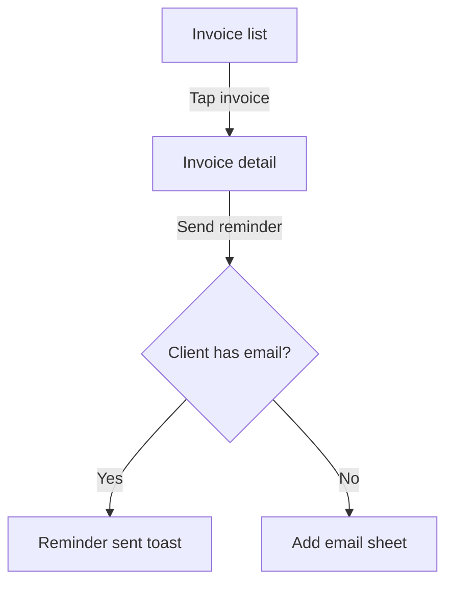

Use this section structure. Adapt depth to how much there is to say, but never delete a section. One that genuinely doesn't apply is marked `Not applicable — <reason>`; one that applies but has nothing behind it yet is marked `Insufficient evidence — <what would resolve it>`. The same two forms apply to a screen state: a state marked `Not applicable — this list cannot be empty` is specified; a state left out is not.

````markdown
# Design Specification: [Product / Feature Name]

**Owner:** [designer or role]
**Date:** [today's date]
**Version:** 0.0.1
**Status:** Draft | In review | Approved | Superseded
**Scope:** Product | Feature | Change
**Platforms:** <carried from the PRD>
**Design file:** [link, or "none yet"]
**Upstream:** <exact upstream filename — `invoice-tracker-prd-ios-v0.2.0.md` — or "Informal brief">
**Downstream:** TRD, QA Test Plan

## Revision History

| Version | Date | Author | Upstream version | Summary | IDs added | IDs changed | IDs removed |
|---|---|---|---|---|---|---|---|
| 0.0.1 | [today's date] | [author] | `<prd filename>`, or Informal brief | Initial draft | FLOW-01–FLOW-03, SCR-01–SCR-09, CMP-01–CMP-07 (every ID in this draft) | — | — |

One appended row per version, never rewritten. The ID columns are what let a downstream document diff this one without re-reading it in full; `—` means none, and an empty cell means the change wasn't tracked, which is a gap worth fixing.

## 1. Overview
What's being designed, for whom, and the design principles or constraints steering it. One short section — the PRD carries the justification.

## 2. Scope
Screens and flows covered here, and explicitly what isn't (other platforms, later phases, existing screens left untouched).

## 3. Information Architecture
Where this lives in the product: navigation placement, hierarchy, and how a user arrives. A tree or Mermaid diagram plus a sentence of rationale.

## 4. User Flows

### FLOW-01 — [Name] (serves PR-xx)
**Entry points:** where a user can start this
**Success path:** numbered steps, each naming the screen and the action
**Branches:** each decision point and where it leads
**Exits:** completion, cancellation, abandonment, timeout — and what persists in each case



## 5. Screen Specifications

### SCR-01 — [Screen name] (serves PR-xx)
**Platforms:** all | web only | iOS, Android | …  — and where it exists on several, whether the layout is shared or genuinely different
**Purpose:** one sentence
**Entry:** how the user arrives; what's in context
**Layout:** regions top to bottom, and the grid/breakpoint behavior
**Elements:** one row per element

| Element | Type / component | Content | Behavior | Notes |
|---|---|---|---|---|
| Header | `PageHeader` | "Overdue invoices" + count | Count updates live | |
| Row | `InvoiceRow` (CMP-02) | Client, amount, days overdue | Tap → SCR-02 | Truncate client name at 1 line |

**States:** walk the state checklist — empty, loading, partial, populated, extremes, errors, offline, permission-denied, disabled, success. Give the exact copy for each.
**Validation:** per input — rule, when it fires (blur/submit/live), the exact message, and the recovery.
**Keyboard and focus:** tab order, initial focus, focus return on close, escape behavior.
**Analytics:** events fired, with properties, tied to the PRD's metrics.

## 6. Component Inventory

| ID | Component | Platforms | New or existing | States | Used on | Props / variants |
|---|---|---|---|---|---|---|
| CMP-01 | `Button/primary` | All | Existing | default, hover, focus, active, disabled, loading | SCR-01, SCR-03 | size: sm/md; icon optional |
| CMP-07 | `ReceiptCapture` | iOS, Android | New | idle, capturing, review, uploading, failed | SCR-09 | — |

**Used on** is this table's upstream column — a `CMP-xx` traces to the `SCR-xx` that render it, the way `FLOW-xx` and `SCR-xx` trace to their `PR-xx` in the heading that opens each one.

Inside one file, where a component exists on several platforms, specify it once and list only the per-platform deltas. Two parallel specifications for "the same" component inside one document is how they stop being the same. Across per-platform files, the same `CMP-xx` keeps its ID and its shared anatomy is written out in full in each — identical wording, so a diff between two platform files shows only real divergence.

For each new component, specify anatomy, sizing, spacing tokens, every state, and its responsive behavior. Flag new components explicitly — each one is a cost.

Never invent a parent ID. Where a `FLOW-xx` or `SCR-xx` serves no real `PR-xx`, or a `CMP-xx` is used on no screen, write `[no upstream — new in this document]` in place of the citation and repeat it in Section 15 — an orphan is either a gap in the PRD or scope creep, and both need a human.

## 7. Interaction and Motion
Transitions between screens, micro-interactions, durations and easing, what animates and what doesn't, and the reduced-motion alternative for each. Motion without a stated duration and easing is not specified.

## 8. Content and Microcopy
Final copy for headings, labels, buttons, empty states, errors, confirmations, and notifications — in one table, so it can be reviewed and localized in a single pass. Include voice and tone notes. Formats and plural rules are Section 9's — specify them there once, and write this copy to match.

## 9. Localization and Internationalization
Target locales, and what they cost the layout: allow roughly 30–35% string expansion from English for European languages, and design for RTL mirroring where Arabic or Hebrew are in scope — which flips layout and iconography but not numerals, logos, or media controls. Specify date, time, number, currency, address, and name formats per locale; plural rules beyond English's two forms; sort order; and which strings must never be translated. Pseudo-localization is the cheapest way to catch truncation before translation exists.

## 10. Responsive and Platform Behavior
Specify only the platforms the header block declares. Name each convention you honor — and each you deliberately break, with the reason.

**Web** — breakpoints and what reflows at each; the minimum supported viewport; hover, focus-visible, and active states (and what replaces hover on touch); keyboard navigation and skip links; browser back and forward, and what the URL must encode; print styles where the content warrants them.

**Mobile** — minimum touch target (44×44pt iOS, 48×48dp Android) and spacing between targets; safe areas, notches, and the home indicator; system back on Android versus in-app back on iOS; orientation support and what changes on rotation; keyboard avoidance and scroll-into-view; pull-to-refresh, swipe actions, and haptics; permission prompts and what the screen shows when one is denied; tablet layout, if tablets are in scope, as a distinct layout rather than a stretched phone.

**Desktop** — window minimum, default, and maximum size, and what reflows on resize; full-screen and multi-window behavior; the native menu bar and context menus; keyboard shortcuts as a complete table, checked against OS reservations; drag-and-drop in and out of the app; multi-select and right-click conventions; tray or menu-bar presence; what the app shows on cold start versus resume.

**Cross-platform** — one shared specification, with a short per-platform delta list. Never three parallel specs; they drift by the second revision.

## 11. Accessibility
The cross-cutting standard and the patterns that apply everywhere. Per-screen specifics — focus order, accessible names, what a screen reader announces on that screen — stay in Section 5 beside the behavior they describe; this section is what they are held to, not a second copy of them.

Target standard: **WCAG 2.2 Level AA** unless a different bar is stated. Cite the specific success criteria a requirement satisfies — 1.4.3 contrast, 2.4.7 focus visible, 2.5.8 target size (minimum), 4.1.2 name/role/value — so the QA plan can test against something nameable rather than a general aspiration. Per screen: semantic structure and heading order, focus order, accessible names for controls and icons, live-region announcements for async changes, contrast ratios for every non-token color pairing, minimum target size, and what a screen reader announces at each step of the primary flow. Treat this as requirements, not aspirations — `qa-test-plan-writer` will write cases against it.

## 12. Design Tokens
Colors, typography, spacing, radii, shadows, and z-index used here — by token name, not raw value. Any raw value in the spec is a bug: either it should be a token or the token is missing, and both are worth saying out loud.

## 13. Design Rationale and Alternatives
The approaches considered and why this one won — a sentence each is enough. This is the section that stops a settled layout debate restarting at every review, and the first thing a designer inheriting this file will look for.

## 14. Validation Plan
How you'll know the design works rather than merely looks finished: what will be tested, with whom, against which task success criteria, and what result would send you back. Where no research is planned, say so — an unvalidated design is a normal, honest state; an unvalidated design presented as settled is not.

## 15. Assumptions and Open Questions
Every gap filled with a guess, every element awaiting visual design, every copy string still `[draft copy]`, and every question that needs product or research input.

## Next Steps
TRD and test plan handoff, remaining design work, and who owns each.
````
